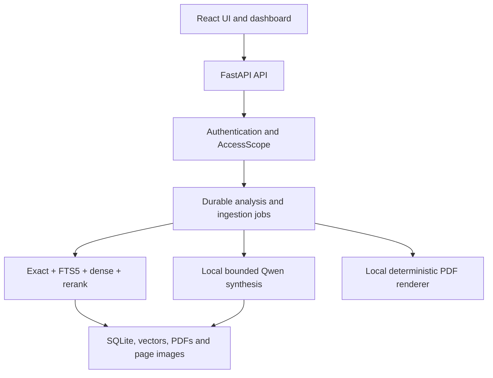
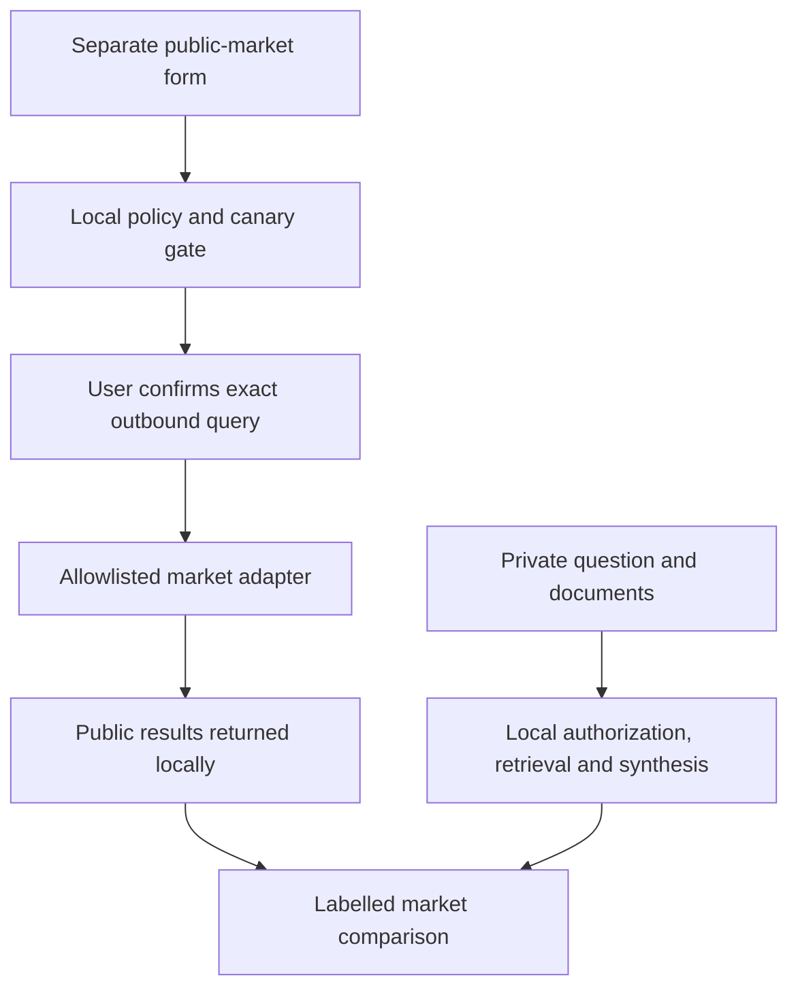

# Nabaa Enterprise FEED Intelligence — Definitive Sunday Execution Plan

**Audience:** Claude coding agent, project owner, client demonstration team  
**Client context:** Saudi Aramco petroleum/industrial engineering prototype  
**Delivery type:** one-day proof of concept, not production deployment  
**Implementation base:** extend the existing Nabaa repository described in `NABAA-CODEBASE.md`  
**Evidence boundary:** the supplied artifact describes the codebase; the repository itself was not attached, so all module names, test counts and measurements are reported until reproduced  
**Development host:** private Windows laptop, 16 GB RAM, CPU only  
**Demonstration host:** private Windows computer, 48 GB RAM, CPU only; CPU/SSD must be measured  
**Future scale target:** up to 1,200 documents of roughly 1,000–1,200 pages; not Sunday-validated  
**Runtime rule:** private documents and derived data stay local  
**Plan status:** architecture decided; implementation remains subject to the no-go gates and measured acceptance tests below  
**Revision:** 4 — 2026-09-05

---

## Executive decision

Do **not** restart the project and do **not** spend the entire day polishing the old
remaining 20% before addressing the expanded scope. First protect the working Phase 1
baseline and fix its two correctness blockers; then build one secure P0/P1 vertical
slice through authorization, comprehensive evidence retrieval, synthesis/gaps/
recommendation, PDF and UI. Leave unrelated Phase 1 polish and all P2 features behind
flags.

A credible Sunday result is possible only as the controlled prototype defined here:
pre-indexed large files, two human-labelled 20-document coverage cases, one small live
upload, single-host low-concurrency operation and measured—not promised—timings. A world-class
production system for 1,200 × 1,000–1,200 pages is not a one-day deliverable; this plan
creates the evidence, interfaces and migration path required to build it responsibly.

---

## 0. Instructions to Claude

Claude must treat this document as the implementation contract.

1. Read `NABAA-CODEBASE.md` completely, especially section 10, before editing.
2. Inspect the real repository; never assume a path, schema, test fixture, model name, or API shape from this plan when the repository differs.
3. Preserve all twelve Nabaa invariants. A change that violates an invariant is rejected even if the UI appears to work.
4. Extend the existing FastAPI, React, SQLite, FTS5, ONNX and Ollama implementation. Do not introduce PostgreSQL, Qdrant, LangChain, LlamaIndex, Docker, Kubernetes, Keycloak or a framework migration for Sunday.
5. Do not rewrite working retrieval, chunking, OCR, highlighting, state transitions, telemetry or document storage.
6. Never put client PDFs, extracted text, SQLite files, vectors, generated reports, secrets, user data, prompts or answers in Git, GitHub Actions artifacts, logs, screenshots or issue bodies.
7. Implement one issue at a time on its named branch. Run targeted tests before committing. Run the full applicable suite before merging.
8. Use typed backend and frontend contracts. New response fields are required unless absence is meaningful and explicitly represented as `null`.
9. Add a planted negative test for each security or correctness guard and confirm it fails before the fix and passes after it.
10. Stop feature work at the cutoff. Prefer a smaller reliable demo over unfinished features.
11. Never claim a test, benchmark, security property or feature that was not directly verified.
12. At completion, update `docs/runbook.md`, `docs/limitations.md`, and `docs/benchmarks.md` with observed results only.
13. Develop and test first with the `development_16gb` resource profile. The same commit must run under `demo_48gb`; do not create machine-specific forks.
14. Treat all timing and quality numbers in this document as targets or reported baseline measurements unless Claude reproduces them on the actual host and records the command, corpus, profile and result.
15. Run a dependency and license inventory before client distribution. PyMuPDF is dual-licensed under AGPL/commercial terms; flag it for owner/legal review rather than assuming commercial redistribution is permitted.

### Non-negotiable current defects

Before new features, fix the live OCR provenance label described in `NABAA-CODEBASE.md`: recognized text must not be labelled “Quoted verbatim from the document.” Also fix the short-follow-up resolver so a short question on a new topic does not inherit unrelated terms.

### Phase 1 preservation contract

This is an **in-place extension**, not a greenfield build. Claude must begin with a written preflight inventory showing the actual function names, database migration pattern, router structure, type-contract generation/mirroring, test commands and current branch. If this reference differs from the repository, the repository and its passing tests are authoritative; update the issue notes before coding rather than forcing an assumed design.

The following existing behavior must remain backward compatible:

- The current upload, document lifecycle and legal state transitions.
- `partially_searchable` remains answerable and `ready` still means embeddings completed.
- Tier 1 remains verbatim and remains available when every new feature flag is off.
- The lexical presence gate remains absolute for local-document questions.
- `rerank_max_tokens == chunk_max_tokens` remains asserted as a relationship.
- `RrfScore` and `RerankScore` remain separate; no new feature may mix score scales.
- Exclusions remain complete and inspectable.
- OCR remains stored in `page_ocr`; extraction must not overwrite it.
- `text_source` remains required end-to-end.
- Unmeasured dashboard values remain `null`, never fabricated zeroes.
- Existing API response contracts do not change silently. Add versioned/new response models for analysis features.
- Existing 494 backend and 99 frontend tests, or the real repository counts, must not be weakened, deleted or converted to skips.

Run a characterization test before editing each touched Phase 1 path. The test must capture current intended behavior, not accidental bugs. Every database migration must be additive and idempotent; do not rename or reinterpret existing columns for Sunday.

### Change budget

Allowed changes are limited to additive migrations, centralized authentication/authorization, document metadata, scoped retrieval parameters, new analysis/report/feedback services, minimal UI additions and targeted correctness fixes. Do not tune chunk sizes, quality thresholds, model quantization, rerank thresholds, OCR settings or measured retrieval heuristics during this feature sprint. Those changes would invalidate the current evidence base and create coupled regressions.

### Twelve-pass review record

This plan was reviewed repeatedly from distinct perspectives. Claude must repeat the same checks against the real diff:

| Pass | Perspective | Finding corrected in this revision | Required implementation proof |
|---|---|---|---|
| 1 | Baseline integration | Earlier plan did not map features to the 33 existing backend modules | Produce a touch/new-file map and keep core algorithms intact |
| 2 | Retrieval correctness | “Search all documents” could be mistaken for putting all pages in the prompt | Retrieve across the authorized scope, then synthesize only validated evidence |
| 3 | Authorization | Earlier `document_access` design was a per-user ACL, not true role-based access | Add role grants, optional user grants, ownership and deny-by-default tests |
| 4 | Confidentiality/egress | Sanitization alone cannot prove a generated query is non-confidential | Build public queries only from separate user-approved public fields; never transform retrieved text into an outbound query |
| 5 | Persistence/migration | Analyses, reports and existing conversation ownership were underspecified | Add complete additive schemas, legacy ownership policy, backup and rollback tests |
| 6 | Performance/concurrency | Global mutable document filters could leak across concurrent requests | Pass immutable access scope per request; benchmark authorization overhead and memory |
| 7 | UI/API compatibility | Adding auth to every route could break existing frontend/tests at once | Centralize dependencies, preserve payloads and use feature flags plus contract tests |
| 8 | Delivery realism | All features were presented as equal priority in one day | Define P0/P1/P2 gates and a no-go decision; never trade security for demo polish |
| 9 | Hardware portability | Earlier wording assumed only the 48 GB host | Add one codebase with measured 16 GB development and 48 GB demo profiles |
| 10 | Synthesis completeness | A short prose summary could hide relevant detail | Keep a complete evidence ledger and evidence appendix separate from the concise synthesis |
| 11 | Job reliability | Long analysis was modelled like a synchronous request | Return `202`, persist progress, stream/poll status and support safe cancellation/resume |
| 12 | Supply chain/licensing | Clean-clone reproducibility and PyMuPDF terms were not explicit | Add locked installs, model hashes, clean-host rehearsal, SBOM and license gate |

No software plan can guarantee zero bugs or zero uncertainty. The professional standard is to identify uncertainty, isolate it, test it, retain rollback, and avoid unsupported claims.

---

## 1. Frozen Sunday outcome

The list below is the full prototype target. P0/P1 items are the Sunday release lane;
P2 items are shown only when their gates pass without consuming the test/handoff
reserve in section 13. The prototype target comprises:

- Local login using prepared Administrator and engineering-role users. Seed Civil, Mechanical, Chemical/Process and IT roles as required by the demonstration dataset.
- Server-enforced role and document access; the role model is configurable rather than hard-coded to Civil/IT.
- A controlled 20-document gold fixture proving that comprehensive mode evaluates every authorized selected document and finds the known relevant set for two prepared questions.
- Six or seven pre-indexed native-text engineering PDFs, each approximately 1,000–1,200 pages, for the scale demonstration. Use twenty large documents only if they are available, pre-indexed and pass the same checks before rehearsal.
- One small live upload to demonstrate ingestion.
- Universal question answering across FEED packages, specifications, standards, manuals, procedures and text-bearing blueprint PDFs.
- Comprehensive multi-document retrieval across every selected document the current user is permitted to read.
- A concise synthesis of all validated relevant evidence, supported by document, page, clause and evidence-span citations.
- A detailed evidence ledger listing every relevant document and atomic supported finding, so information omitted from the concise prose through compression remains inspectable.
- Evidence panels and rendered source pages using existing Nabaa capabilities.
- Explicit conflicts and an honest insufficient-evidence response.
- A preliminary structured gap analysis.
- An AI-generated advisory recommendation separated from documentary facts.
- A downloadable, locally generated PDF report.
- Approved organizational memory (“governed learning”), not autonomous training.
- Optional public-market search through a sanitized, allowlisted egress boundary.
- Persistent local chat and report history.
- A dashboard showing documents, pages, roles, reports, model state and measured latency.
- Reproducible startup from the same repository commit on the 16 GB development laptop and 48 GB demonstration computer.

### Sunday acceptance statement

> Nabaa demonstrates a private, role-controlled FEED document intelligence workflow. Authorized engineers can comprehensively evaluate selected pre-indexed documents, see exactly which documents supplied evidence or failed, receive evidence-backed consolidated findings, inspect the complete evidence ledger and page-level sources, perform a preliminary gap assessment, obtain clearly labelled advisory recommendations, compare optional public-market evidence, and export an auditable PDF report. Public market research is isolated from private document context.

### Universal question contract

The system is not a standards-only assistant. A user may ask any question whose answer can be supported by their authorized engineering corpus, including:

- factual lookup, definition or identifier;
- procedure, sequence or responsibility;
- equipment/material/design requirement;
- cross-document summary;
- comparison, contradiction or revision difference;
- risk, constraint, dependency or missing-information analysis;
- table/list extraction when source structure is sufficiently preserved;
- preliminary gap analysis;
- evidence-backed advisory recommendation;
- public market context using the isolated egress workflow.

The same evidence rules apply to every intent. The system must not invent an answer merely because the question is not about a named standard.

### Not promised Sunday

- Production readiness or Saudi Aramco approval.
- Certified engineering, safety, legal or regulatory compliance.
- Production validation for 1,200 documents or 1.2+ million pages.
- Reliable interpretation of CAD, P&ID, schematics, dimensions or arbitrary blueprint graphics.
- Corporate SSO, Active Directory, high availability, disaster recovery or key management.
- Many simultaneous users.
- Autonomous model retraining or unreviewed self-learning.
- Unrestricted browsing or guaranteed real-time market coverage.
- A guarantee that every question uses every uploaded document.
- A guarantee of perfect recall for arbitrary documents or questions. Comprehensive mode searches every authorized selected document; fixture-specific recall is measured and failures are visible.
- Full hybrid readiness for 7,200 pages within minutes.
- Guaranteed counting, calculation, table-cell reasoning or drawing interpretation unless that capability has a dedicated tested tool and acceptance set.

### Sunday proof matrix

| Proof | Corpus | What the client sees |
|---|---|---|
| Functional coverage | 20 controlled authorized documents; Query A has 15 relevant, Query B has 10 relevant | All 20 receive a terminal status; relevant-document recall and claim coverage are scored against human-labelled gold evidence |
| Large-document scale | Six or seven available pre-indexed 1,000–1,200-page native-text/mixed PDFs | Real retrieval, synthesis, citations and measured latency; no claim that all vectors/OCR completed in minutes |
| Live ingestion | One small public/synthetic PDF | Upload, hash, extraction, keyword-searchable state, background semantic/OCR progress |
| Security | Prepared users, grants and canary data | Cross-role denial, private-data egress test and access-controlled report download |

Do not substitute one proof for another. A 20-document small fixture validates coverage logic; large pre-indexed files validate scale behavior; neither proves the eventual 1.2+ million-page production target.

### One-day delivery cutline agreed by this plan

| Feature | Sunday release form | If its gate fails |
|---|---|---|
| Local chat/history/dashboard | Real, persisted and role-scoped | No-go for the expanded demo |
| Role-based document access | Real server-side enforcement for prepared users/documents | Disable multi-user demo; never fake RBAC |
| 20-document comprehensive Q&A | Real against a human-labelled controlled fixture | Show existing focused evidence only and state the blocker |
| Six/seven × 1,000–1,200-page corpus | Pre-indexed scale rehearsal with measured times | Use fewer validated large files and disclose the exact count |
| Summary and evidence ledger | Real, citation-validated output | Fall back to extractive evidence ledger; no uncited synthesis |
| AI recommendation and gap analysis | Real bounded structured output, advisory only | Hide the section if validation fails |
| PDF report | Real local rendering from immutable snapshot | Local HTML export labelled as fallback; do not claim PDF complete |
| Governed “self-learning” | One approved, revocable glossary/correction example | Defer UI; never claim autonomous learning |
| Market intelligence | Approved live provider only if privacy test passes; otherwise dated local public sample | Disable egress and label the sample clearly |
| Automatic categorization | Suggestion-only on labelled fixtures | Use manual discipline tags |

This table is the commitment boundary. A polished screen or scripted output does not
convert a failed gate into a completed feature.

---

## 2. Why this design

| Decision | Choice for Sunday | Reason |
|---|---|---|
| Application foundation | Extend Nabaa | It already has measured ingestion, hybrid retrieval, citations, OCR, UI, telemetry and 593 reported tests. Rebuilding adds risk without demo value. |
| Backend | Keep FastAPI | Existing 21-route API and strict validation are working; FastAPI also supports dependency-based security and OAuth2/JWT scopes. |
| Frontend | Keep React/TypeScript | Existing four-screen UI and shared type contract can be extended safely. |
| Database | Keep SQLite WAL | One local demo host and a one-day deadline do not justify a data migration. PostgreSQL is a post-demo production milestone. |
| Retrieval | Keep FTS5 + dense vectors + RRF + reranker | The current pipeline is measured and contains scale-safety types. RRF is an established way to fuse rankings, and replacing it would invalidate prior evaluation. |
| RAG framework | Keep the tested custom pipeline; add typed services | LangChain/LlamaIndex would duplicate existing retrieval, state and citation abstractions. Reconsider only for a separately benchmarked production feature. |
| Chunking | Keep 300 target / 480 maximum / 60 overlap | It is structure-aware, measured and fits multilingual-E5-small's 512-token limit. Do not add semantic chunking without an A/B evaluation. |
| Embedding | Keep multilingual-e5-small ONNX int8 | Its 384-dimensional CPU footprint and current index are measured. Changing models requires complete re-embedding and retrieval regression testing. |
| Generator | Keep the existing local Qwen3.5:4B runtime | It fits the 16 GB system and is integrated. A 9B model on 48 GB is only a challenger after a domain quality/latency/RAM bake-off, never an assumed upgrade. |
| Reranker | Keep the existing ONNX int8 cross-encoder | Retrieve-then-rerank is appropriate; its batch sensitivity is already characterized. Fix the displayed model identity but do not tune thresholds Sunday. |
| Job execution | Existing durable worker/jobs table plus subprocesses | Heavy ingestion/analysis must not run as in-process FastAPI background work. Return `202`, persist status and stream progress. |
| Hardware | Same code, two configuration profiles | Low-memory development catches resource regressions; demo profile uses extra memory only where benchmarks prove benefit. |
| “Smart agent” | Bounded deterministic workflow | It gives visible analysis without arbitrary tools, loops, shell access or hidden actions. OWASP warns against unrestricted agent permissions. |
| Self-reflection | Evidence sufficiency and citation verifier | Self-RAG/CRAG motivate critique and correction, but their training procedures cannot be implemented honestly in one day. |
| Long documents | Retrieve small evidence, expand parents | Research shows long context does not ensure reliable use of all included information; ranked evidence is safer and faster. |
| Access control | Filter before retrieval and recheck resources | Unauthorized chunks must never enter retrieval candidates, prompts, generated answers or reports. Frontend-only hiding is rejected. |
| Market web search | Separate sanitized egress broker | Public information may be fetched, but no private source text, filenames, project names, prompt history or identifiers leave the machine. |
| Learning | Human-approved memory records | Automatic learning from answers can amplify errors and poison the knowledge base. Approval preserves provenance and rollback. |
| Recommendations | Separate, cited and advisory | Engineering recommendations are not source facts and require qualified human review. |
| Reports | Deterministic HTML template to PDF | A fixed template is testable and auditable; the LLM provides structured content, not layout code. |
| Large demo corpus | Pre-index before client meeting | Six or seven huge files may take tens of minutes for vectors and much longer for OCR. A live bulk upload creates avoidable demo risk. |
| Production-scale vectors | Defer Qdrant/PostgreSQL until a representative benchmark fails the SQLite SLO | Qdrant supports filtered/on-disk ANN, but a Sunday migration would add a second unvalidated retrieval implementation. |
| Portable installation | Preserve the current manager; require exact locks and a clean-clone test | Adopt `uv.lock` only if a time-boxed migration passes the complete suite; always use `npm ci` with the committed frontend lock. |
| PDF dependency | Renderer interface; choose after Windows smoke test | Report quality is an acceptance test. Do not assume WeasyPrint native dependencies or maintain two active renderers. |

### Research basis

- [Lewis et al., RAG](https://arxiv.org/abs/2005.11401) supports explicit retrieved memory and provenance instead of relying only on model parameters.
- [Cormack, Clarke and Buettcher, RRF](https://research.google/pubs/reciprocal-rank-fusion-outperforms-condorcet-and-individual-rank-learning-methods/) supports rank-based fusion of multiple retrieval systems.
- [Self-RAG](https://arxiv.org/abs/2310.11511) and [Corrective RAG](https://arxiv.org/abs/2401.15884) support evaluating retrieved evidence and correcting weak retrieval. Sunday adapts these ideas as deterministic gates rather than claiming to reproduce the trained methods.
- [Lost in the Middle](https://direct.mit.edu/tacl/article/doi/10.1162/tacl_a_00638/119630/Lost-in-the-Middle-How-Language-Models-Use-Long) shows that longer context can reduce reliable use of information depending on its position; Nabaa should send compact ranked evidence, not complete documents.
- [OWASP RAG Security](https://cheatsheetseries.owasp.org/cheatsheets/RAG_Security_Cheat_Sheet.html), [Authorization](https://cheatsheetseries.owasp.org/cheatsheets/Authorization_Cheat_Sheet.html), [SSRF Prevention](https://cheatsheetseries.owasp.org/cheatsheets/Server_Side_Request_Forgery_Prevention_Cheat_Sheet.html), and [AI Agent Security](https://cheatsheetseries.owasp.org/cheatsheets/AI_Agent_Security_Cheat_Sheet.html) motivate deny-by-default authorization, untrusted-source handling, restricted tools and allowlisted egress.
- [NIST AI 600-1](https://doi.org/10.6028/NIST.AI.600-1) emphasizes governance, provenance and pre-deployment evaluation; the prototype therefore records evidence, versions, limitations and human-review status.
- [RAGChecker](https://arxiv.org/html/2408.08067v1) separates retriever claim recall/context precision from generator faithfulness/hallucination; Nabaa therefore evaluates discovery and generation independently.
- [Sentence Transformers retrieve-and-rerank guidance](https://sbert.net/examples/sentence_transformer/applications/retrieve_rerank/README.html) supports using the cross-encoder only on a bounded first-stage candidate set.
- [PyMuPDF multiprocessing guidance](https://pymupdf.readthedocs.io/en/latest/recipes-multiprocessing.html) states that PyMuPDF is not thread-safe and recommends page-range multiprocessing; the existing process-based extraction design remains.
- [SQLite WAL](https://sqlite.org/wal.html) supports simultaneous readers and a writer, while retaining a single-writer model; this is suitable for the single-host prototype, not proof of multi-user production scale.
- [Qdrant capacity planning](https://qdrant.tech/documentation/capacity-planning/), [filtered indexing](https://qdrant.tech/documentation/manage-data/indexing/) and [on-disk optimization](https://qdrant.tech/documentation/ops-optimization/optimize/) support it as a phase-two candidate after representative measurement.
- The [multilingual-e5-small model card](https://huggingface.co/intfloat/multilingual-e5-small) documents 384 dimensions and 512-token truncation, matching the existing 480-token chunk maximum. The [Qwen3.5-4B model card](https://huggingface.co/Qwen/Qwen3.5-4B) and [license](https://huggingface.co/Qwen/Qwen3.5-4B/blob/main/LICENSE) verify the model family and Apache-2.0 terms; they do not prove Nabaa's domain accuracy.
- [`uv.lock`](https://docs.astral.sh/uv/concepts/projects/layout/) is cross-platform and supports frozen installs, while [`npm ci`](https://docs.npmjs.com/cli/v11/commands/npm-ci/) fails on lock/manifest mismatch. The clean-clone acceptance test, not the existence of a README, proves portability.

---

## 2A. Frozen system architecture



The API process stays lightweight and uses one Uvicorn worker in the prototype so model memory is not duplicated. Existing worker/subprocess boundaries handle heavy CPU stages. FastAPI's own documentation recommends larger process/queue tools for heavy computation rather than relying on in-process `BackgroundTasks`; Nabaa already has a durable `jobs` foundation, so reuse it: [FastAPI background-task caveat](https://fastapi.tiangolo.com/tutorial/background-tasks/).

### Component boundaries

| Component | May read private documents? | May access internet? | Responsibility |
|---|---:|---:|---|
| Core API, retrieval, local LLM, report renderer | Yes, after authorization | No | Private Q&A, analysis, citations and reports |
| Market-query policy service | No raw document/evidence access | No | Validate only the separate public query object |
| Market provider adapter | No | Yes, only approved provider | Send approved generic query and return public results |
| Browser frontend | Only through authorized API responses | Only local API in offline mode | User control, progress, evidence inspection and approval |

This is a prototype separation, not a formal data-loss-prevention guarantee. For a client deployment, enforce the boundary with OS/network controls or a separate gateway host, not only Python code.

---

## 2B. Final stack and model decision

“Best” means best on Nabaa’s domain evaluation under its hardware, privacy and
latency constraints—not the model with the largest parameter count or newest model
card.

| Layer | Sunday decision | Why it is the lowest-risk correct choice | Deferred challenger and promotion gate |
|---|---|---|---|
| Python API | FastAPI + one Uvicorn worker | Already integrated, typed and tested; a lightweight request process can delegate CPU-heavy work to the existing durable worker | No framework rewrite. Scale API/workers separately only after a concurrent-load test |
| RAG orchestration | Typed Nabaa services/state machine | Existing search, scoring, citations, jobs and lifecycle rules are domain-specific | LangChain/LlamaIndex only if a named future feature saves more code than it duplicates and passes regression tests |
| Parser | Existing PyMuPDF fast-text path; RapidOCR fallback | Preserves measured partial-search latency and provenance | Docling/layout or vision enrichment only for a separate table/drawing benchmark |
| Chunking | Existing structure-aware 300 target / 480 max / 60 overlap | Fits the current embedder/reranker token boundary and has measured quality gates | Semantic/hierarchical challenger must improve gold claim recall without unacceptable chunk count/latency |
| Embedding | multilingual-e5-small, ONNX int8, 384 dimensions | Already indexed, multilingual, CPU-feasible and 512-token limited in a way compatible with the current maximum | BGE-M3 is a credible long-context/multilingual challenger, but requires full re-embedding and wins only after hit@k, RAM, disk and ingestion testing |
| Lexical retrieval | SQLite FTS5 | Exact identifiers, tags, clauses and engineering terminology remain crucial; fast and already local | PostgreSQL FTS only with the production metadata migration |
| Dense store | Existing local vector cache for Sunday | Avoids a risky one-day migration and preserves current regression evidence | Qdrant on-prem for millions of chunks after filtered-ANN benchmark and access-filter correctness tests |
| Rank fusion | Existing RRF with separate score types | Safely combines lexical and semantic rank positions without mixing incomparable raw scores | No change unless offline evaluation shows a statistically meaningful improvement |
| Reranker | Existing cross-encoder ONNX int8 | Second-stage reranking is the measured accuracy step and stays bounded | Promote another reranker only after domain nDCG/claim-recall, p95 and RAM bake-off |
| Generator | Qwen3.5:4B through local Ollama | Already integrated, local and feasible on 16 GB; model family/license can be identified | Test a larger local model on 48 GB, but promote it only if supported-claim completeness improves and p95/RAM remain acceptable |
| Metadata/history | SQLite WAL | Correct for a single-host prototype and preserves existing data | PostgreSQL on-prem for multi-user concurrency, policy joins, HA and operational controls |
| UI | Existing React 19 + TypeScript + Vite + Tailwind | Preserves the completed frontend and shared contracts | No framework migration |
| PDF | One locally validated deterministic renderer | Keeps private evidence offline and makes layout testable | Select WeasyPrint or ReportLab after the Windows smoke test; do not use a cloud converter |

The 48 GB machine is not permission to silently switch models. Run the same fixed
question/citation set against the current model and one challenger, then record:
retrieval claim recall, citation precision/entailment, unsupported-claim rate,
structured-JSON validity, p50/p95 generation time and peak RAM. Change the demo model
only if the challenger passes every hard safety gate and materially improves the
human-reviewed quality score. Keep its exact name, revision, quantization, hash,
context size and runtime options in `models/manifest.json`.

Official model cards establish configuration and license facts, not engineering
accuracy. The existing [multilingual-e5-small card](https://huggingface.co/intfloat/multilingual-e5-small)
documents 384 dimensions and 512-token truncation. [BGE-M3](https://huggingface.co/BAAI/bge-m3)
is a post-demo retrieval challenger with longer input and multiple retrieval modes.
The [Qwen3.5-4B card](https://huggingface.co/Qwen/Qwen3.5-4B) and
[license](https://huggingface.co/Qwen/Qwen3.5-4B/blob/main/LICENSE) identify the model
and Apache-2.0 terms; they do not establish Nabaa’s quality until the above evaluation
passes.

### 2B.1 RAG architecture classification

The selected architecture is:

> **Authorization-filtered, coverage-aware hybrid RAG with governed conversation/
> organizational memory, hierarchical multi-document synthesis and a bounded
> corrective verifier.**

| RAG family | Sunday use | Decision reason |
|---|---|---|
| Naive dense RAG | No | Dense-only retrieval can miss exact tags, clauses, codes and rare identifiers |
| Hybrid RAG | Yes—the base | Existing exact/FTS and dense retrieval, RRF and reranking combine lexical precision with semantic recall |
| RAG with memory | Yes, governed | Chat history helps resolve intent; approved organization memory is separate and revocable; neither replaces source evidence |
| Corrective/Self-RAG | Pattern only | One bounded retry plus evidence/citation validation gives useful correction without pretending the local model was trained as Self-RAG |
| Agentic RAG | Bounded workflow only | The orchestrator chooses from fixed stages with no arbitrary tools, URLs or loops; a general autonomous agent is too risky for private engineering data |
| Graph RAG | No for Sunday | No trusted entity/relationship graph exists yet; constructing one from 1.2+ million pages adds extraction errors and operational cost before value is proven |
| Multimodal RAG | Text/OCR boundary only | Page images support human verification, but current text models cannot guarantee CAD/P&ID/spatial understanding; evaluate a separate vision path later |
| Long-context “put every document in prompt” | No | It is slow, exceeds local budgets and does not guarantee information use; retrieve/evidence-map/synthesize hierarchically instead |

This naming must be used consistently in the UI, architecture decision record and
client explanation. Do not market the Sunday system as GraphRAG, a self-training
agent, or full multimodal blueprint intelligence.

---

## 3. Privacy boundary and threat model

### 3.1 Data that must never leave the local machine

- Original or derived client documents.
- Extracted/OCR text, chunks, embeddings and vector indexes.
- Document filenames, hashes, project identifiers and revision metadata.
- Questions that mention confidential assets, facilities, projects or requirements.
- Retrieved context, answers, citations, page images and generated reports.
- Users, roles, password hashes, conversations, feedback and organizational memory.
- Logs, stack traces, database backups and model prompts.

### 3.2 Allowed outbound data

Only an explicitly approved public-market query containing generic public terms, for example. The query must be entered or assembled from a **separate public-market form**; it must never be generated by paraphrasing private retrieved evidence:

```json
{
  "query": "public market availability of ASTM A615 Grade 60 rebar Saudi Arabia 2026",
  "country": "Saudi Arabia",
  "freshness_days": 30
}
```

Forbidden example:

```json
{
  "query": "Find alternatives for material in Aramco Project SECRET-123 based on clause 7.4 and this extracted paragraph..."
}
```

### 3.3 Egress architecture

The core answer path remains local. Web search is an optional independent evidence source.



Mandatory controls:

1. `WEB_SEARCH_ENABLED=false` by default.
2. The LLM cannot construct or call arbitrary URLs.
3. Provider base URLs are configuration allowlists, not user input.
4. Only `https` is accepted; block localhost, private, link-local and metadata IP ranges.
5. Do not follow redirects outside the allowlist.
6. Query payload passes a deterministic secret/confidentiality scanner.
7. Query must not contain text copied from retrieved chunks.
8. Query must not contain filenames, document IDs, project IDs, user IDs or conversation history.
9. The UI displays the exact outbound query and requires user approval for Sunday.
10. Log only query hash, approval, provider, timestamp and result count; do not log the raw sensitive input.
11. Public web content is untrusted data and cannot issue agent instructions.
12. Market findings appear under `Public market information`, never under `Documented requirements`.
13. If policy rejects the query, the system continues with local documents and explains that public search was not performed.
14. Add a hard network-kill configuration for the client: `ALLOW_PUBLIC_EGRESS=false`.
15. Do not claim that regex/redaction makes arbitrary private text safe. Redaction is a final guard, not authorization to export internal text.
16. The provider receives only fields from the public-market form after user confirmation. The internal engineering question remains local.
17. Store public result title, publisher, URL, retrieval time and excerpt locally. Do not treat a search snippet as a verified engineering standard.
18. For Sunday, fetch only search results/snippets or an approved small page set; do not create a general crawler.
19. The market adapter process receives no database path, vector index handle, report path or conversation object—only the approved `PublicMarketQuery` schema.
20. Treat provider snippets as preliminary evidence. Record source URL, publisher, publication/retrieval dates and freshness; state `source_not_verified` when the underlying page was not inspected.
21. If actual Saudi Aramco information is used, run only on a client-approved device and storage location. Application code alone does not authorize possession or processing of client data.

### 3.4 Demo privacy proof

Run the application with web search disabled and prove document Q&A still works. Then enable the test adapter and capture the exact generic outbound query. Search the capture for private document text, filenames and IDs; the test passes only when none are present.

### 3.5 Local-host hardening for the prototype

- Bind FastAPI, the frontend preview server and Ollama to loopback only. Verify the
  listening sockets in `doctor-windows.ps1`.
- Keep the repository, runtime bundle, database, temp directory and reports outside
  OneDrive/Dropbox/Google Drive or any auto-synchronized folder.
- Use a dedicated non-administrator Windows account, BitLocker/device encryption,
  automatic screen lock and an encrypted transfer device according to client policy.
- Disable analytics, crash uploads, remote fonts/CDNs and package-manager activity at
  runtime. Install dependencies before private documents are loaded.
- Apply a restrictive Content Security Policy and escape all user/document content;
  a PDF can contain prompt injection or hostile HTML-like text.
- Put generated temp files below an application-owned directory with restrictive
  permissions. Use random server-side names and retention cleanup. Do not promise
  secure erasure from SSD media.
- Log event types, IDs/hashes, durations and outcomes—not prompts, document text,
  filenames, tokens or rendered answers. Protect audit logs with the same role scope.
- Default the OS firewall to block application egress. If live public search is shown,
  permit only the isolated market adapter/provider and restore the block immediately
  afterward.
- Treat “local-only” as a deployment property to verify, not a slogan. SQLite is not
  encrypted by default; the Sunday control is encrypted storage plus OS account
  isolation. Application/database encryption and managed keys remain production work.

---

## 4. Bounded “smart agent” design

Do not implement a general autonomous agent. Implement `EngineeringAnalysisOrchestrator`, a state machine with bounded steps and no shell, filesystem, SQL, email or arbitrary HTTP tools.

### 4.1 Modes

- `extract`: existing verbatim Tier 1 answer.
- `synthesize_focused`: cited answer using global retrieval for a narrow lookup.
- `synthesize_comprehensive`: coverage-aware cited synthesis across every selected authorized document.
- `gap_analysis`: structured comparison against retrieved requirements.
- `recommend`: advisory recommendation after evidence validation.
- `market`: optional sanitized public evidence plus local evidence.
- `report`: render an already validated analysis result.

Intent and coverage mode are separate. A question may be factual, procedural, comparative, analytical or summarizing; any of those may require focused or comprehensive coverage. If the user selects `Analyze all selected documents`, comprehensive mode is mandatory. The LLM may recommend comprehensive mode, but it may not silently reduce a user-requested comprehensive analysis to focused mode.

### 4.2 Workflow

1. Authenticate user.
2. Resolve conversation follow-up without unrelated term borrowing.
3. Classify intent and requested mode.
4. Build an immutable `AccessScope` from the server-side user record.
5. Classify the answer operation: lookup, procedure, summary, comparison, gap, recommendation, calculation/counting, or unsupported visual/structured operation.
6. Decompose complex questions into at most three subquestions without narrowing or changing the user’s meaning.
7. Choose focused or comprehensive coverage. In comprehensive mode, run a bounded retrieval pass independently for every selected authorized document and record a status for each.
8. Fuse, rerank and deduplicate using existing Nabaa components while retaining document identity and provenance.
9. Produce citation-preserving per-document evidence maps, then compare them across documents.
10. Evaluate evidence sufficiency, coverage, agreements, conflicts, revision differences and missing information.
11. If weak, reformulate once and retrieve once more. No unbounded loop.
12. Refuse unsupported claims or unsupported operation types.
13. Generate structured documentary findings from validated evidence.
14. Verify that every factual claim maps to one or more real citation IDs and that numeric values/units are present in cited evidence.
15. Generate agreements, conflicts and preliminary gap items when applicable.
16. Optionally accept a separately entered public query, pass the policy/user-approval gate and collect public evidence; never derive it from private evidence.
17. Compare public-market findings with documentary findings without treating the public source as an internal requirement.
18. Generate the separately labelled advisory recommendation last, using only the validated sections available.
19. Persist inputs, per-document coverage, evidence IDs, result, model/config versions and timings locally.
20. Render report on explicit user action.

Long comprehensive work is asynchronous. `POST` returns `202 Accepted` and an `analysis_id`; the worker persists checkpoints after document coverage, evidence maps, synthesis batches, market comparison and validation. The UI uses SSE when available and polling as fallback. Cancellation stops at the next safe checkpoint and retains an auditable `cancelled` lifecycle status without presenting a partial result as complete.

### 4.3 Intelligence without hidden chain-of-thought

Return an auditable rationale, not private model chain-of-thought:

```json
{
  "documented_findings": [],
  "cross_document_analysis": [],
  "conflicts": [],
  "gaps": [],
  "recommendation": {},
  "assumptions": [],
  "confidence": "low|medium|high",
  "citations": [],
  "retrieval_summary": {
    "authorized_documents_selected": 20,
    "documents_attempted": 20,
    "documents_search_completed": 20,
    "relevant_documents": 15,
    "no_sufficient_evidence_documents": 5,
    "failed_documents": 0,
    "not_searchable_documents": 0,
    "passages_considered": 120,
    "retry_used": false
  }
}
```

Never display scratchpad tokens or ask the model to reveal hidden reasoning. “Analysis” means evidence, comparison, assumptions, conflicts and a concise justification.

### 4.3A Canonical evidence contract

Every downstream section uses immutable evidence objects rather than free-form copied strings:

```json
{
  "evidence_id": "ev_...",
  "citation_id": "citation_...",
  "document_id": "doc_...",
  "document_title": "...",
  "revision": "...",
  "approval_status": "approved|draft|superseded|unknown",
  "page_start": 417,
  "page_end": 417,
  "section": "7.4.2",
  "text_source": "extracted|recognised",
  "exact_span": "...",
  "parent_context": "...",
  "content_hash": "sha256:...",
  "relevance_score_type": "rerank",
  "relevance_score": -1.82,
  "supported_facets": ["material", "temperature_limit"]
}
```

The browser may show a shortened excerpt, but report reproduction uses the stored immutable evidence snapshot. It never fetches current document text silently when regenerating an older report.

### 4.4 Evidence sufficiency gate

An answer may proceed only when:

- The existing lexical presence gate passes for distinctive local terms.
- At least one authorized passage exceeds the existing credibility threshold.
- Each generated factual claim has a valid supporting citation.
- Numeric claims preserve value, unit and identifier from evidence.
- Conflicting current requirements are presented as conflicts, not silently merged.
- OCR-derived claims carry recognized-text provenance.

Otherwise return `INSUFFICIENT_EVIDENCE` with the passages checked and suggestions for narrowing the question.

### 4.5 Multi-document synthesis

- Retrieve 30 lexical and 30 dense candidates per existing configuration.
- Preserve existing RRF, identifier precedence, conflict penalty and cross-encoder reranking.
- Retain every validated atomic evidence item in the evidence ledger; cap only what enters any single LLM call.
- Add diversity after reranking for each synthesis batch: start with up to three complementary passages per document, then create additional deterministic batches for remaining non-duplicate supported facets. Never delete an evidence item merely because a prompt is full.
- Prefer approved/current revisions over obsolete ones only when revision metadata is explicit.
- Never summarize an entire 1,200-page document by placing it into the prompt.
- Interpret “summarize across all documents” as “retrieve all relevant evidence from all authorized selected documents and synthesize it.”
- Report how many authorized documents were searched and which supplied evidence.

### 4.5A What “do not miss information” means operationally

A prose summary is intentionally compressed and cannot contain every sentence from thousands of pages. Nabaa therefore exposes two products:

1. **Consolidated answer:** a readable synthesis of the question-relevant claims, agreements and conflicts.
2. **Complete validated evidence ledger:** all retained atomic findings from every relevant document, with page/clause/span citations, document status and inclusion reason. The PDF contains this as a detailed appendix.

Nothing may be silently removed between the validated ledger and report snapshot. Deduplication may cluster equivalent findings, but every source document remains attached to the cluster. A source can disappear from the prose only when another source states the same supported proposition; it must remain visible under `Also supported by` and in the evidence appendix.

Coverage quality is evaluated with human-labelled fixtures:

- relevant-document recall;
- atomic-claim recall;
- citation precision and entailment;
- unsupported-claim rate;
- non-relevant-document exclusion;
- failed/not-searchable visibility.

The Sunday fixture requires 100% relevant-document recall and 100% citation precision for its prepared questions. Those scores describe the fixture only; they are not a universal guarantee.

#### Focused versus comprehensive retrieval

The existing global `30 lexical + 30 dense -> RRF -> rerank 16` pipeline remains the fast focused path. It cannot by itself prove coverage across 20 documents because globally strong passages can crowd out relevant passages from other documents.

Comprehensive mode adds a document-axis coverage pass:

1. Resolve `selected_document_ids ∩ allowed_document_ids` on the server.
2. For every effective document, run exact entity/identifier matching plus existing lexical and dense retrieval with a small per-document candidate quota.
3. Rerank the pooled candidates in deterministic batches while retaining a fair validation opportunity for each document; no document is called non-relevant solely because another document filled the global top-k.
4. Assign exactly one per-document status: `relevant`, `no_sufficient_evidence`, `failed`, or `not_searchable`.
5. Build an evidence map for each relevant document with exact citation IDs.
6. Split evidence maps by supported query facet and deterministic token budget when one LLM call would overflow.
7. Produce citation-preserving batch syntheses and retain the underlying evidence IDs.
8. Reduce the batches recursively into agreements, additions, conflicts, gaps and final findings without losing source provenance.
9. Run claim-to-citation validation on the final output.
10. Return the coverage ledger with searched/relevant/no-evidence/failed counts.

Do not expose counts or identities of selected documents that were removed by authorization. The user-visible ledger begins from the effective authorized scope.

#### Universal evidence query plan

The planner extracts, when present:

- entities, assets, materials, systems and components;
- acronyms, identifiers, tags, clauses and drawing references;
- actions, responsibilities and lifecycle stage;
- numbers, units, ranges and tolerances;
- time, revision, approval and applicability constraints;
- requested comparison dimensions;
- whether the user wants an exhaustive selected-document analysis.

It then produces bounded lexical and semantic variants. Exact identifiers and quoted phrases are never discarded or replaced by an LLM paraphrase.

#### Coverage honesty

“No relevant evidence found” is a retrieval result, not proof that a document contains nothing relevant. If a document is not searchable or a retrieval step fails, the final analysis is explicitly incomplete. “All relevant information” is an evaluation target measured with human-labelled claim recall; it is not a guarantee created by prompting.

[RAGChecker](https://arxiv.org/html/2408.08067v1) separates retrieval claim recall/context precision from generator faithfulness and hallucination, which is why Nabaa must measure evidence coverage and generated-answer support independently. Research on sub-question coverage likewise treats completeness as a separate evaluation target rather than assuming a fluent response is comprehensive: [sub-question coverage](https://arxiv.org/html/2410.15531v1).

#### Fast comprehensive execution on both CPU-only hosts

Parallelize only work that benefits from it. Do not launch one local LLM or one heavily threaded ONNX reranker per document.

1. Normalize the question and compute each query-variant embedding once; reuse it for all 20 documents.
2. Resolve the immutable authorized/selected document scope once.
3. Run exact/FTS retrieval per document with a bounded read pool. Each worker uses its own SQLite read connection.
4. Score dense similarity over the selected authorized vector rows in one vectorized pass when practical, then partition results by document and take a per-document quota. This is usually more efficient than 20 matrix scans.
5. Merge/deduplicate candidates per document using existing RRF and identifier rules.
6. Rerank candidates in deterministic per-document batches. Do not run competing reranker sessions because the existing ONNX session already uses CPU threads and measured quantization scores are batch-sensitive.
7. Apply the credibility/evidence gate independently per document; only validated relevant documents continue.
8. Build extractive evidence maps first. Do not call the LLM merely to copy passages.
9. If all evidence maps fit the existing context budget, synthesize once. Otherwise group them into deterministic citation-preserving batches, summarize batches sequentially, then perform one final reduce.
10. Stream stage progress: `20 searched -> 15 relevant -> synthesis batch 1/N -> validation -> complete`.

Expose configuration through one of two committed profiles. These are conservative
starting points, not performance claims:

| Resource control | `development_16gb` | `demo_48gb` | Selection rule |
|---|---:|---:|---|
| Uvicorn API workers | 1 | 1 | Multiple workers duplicate model/session memory and are not needed for a local prototype |
| Active comprehensive analyses | 1 | 1 | Queue additional analyses; do not let two generations compete |
| FTS/read workers | Start at 1; benchmark 1 and 2 | Start at 2; benchmark 1, 2 and 4 | Keep the fastest setting that does not raise peak RAM or p95 latency materially |
| SQLite connections | One read connection per worker | One read connection per worker | Never share one connection concurrently |
| Dense query embedding | One, reused for all documents | One, reused for all documents | Do not recompute per document |
| Dense scoring | One vectorized selected-scope pass | One vectorized selected-scope pass | Partition top results by document after scoring |
| Reranker sessions | 1 | 1 | Batch through the measured ONNX session; avoid thread oversubscription |
| Local LLM streams | 1 | 1 | Sequential citation-preserving synthesis batches |
| OCR processes | 1, never during Q&A | 1 initially; test 2 only in an isolated benchmark | The current 16 GB measurement says two OCR workers do not fit; 48 GB alone does not prove two are faster |
| Embedding ONNX arena | Off during Q&A if memory pressure is observed | On only if benchmarked beneficial | Stage scheduler owns the transition |
| Context/output budget | Use existing safe defaults for focused answers; measure a larger dedicated comprehensive profile before enabling | Same | Do not assume the current 1,536-token context and 100-token output can produce a detailed 15-document synthesis |

Shared bounds belong in configuration, but batch/token/concurrency values must be
recorded as measured profile results rather than described as universally optimal:

```python
coverage_max_documents = 20
coverage_lexical_per_doc = 8       # initial evaluation value
coverage_dense_per_doc = 8         # initial evaluation value
coverage_rerank_per_doc = 8        # initial evaluation value
coverage_max_subqueries = 3
coverage_max_retries = 1
```

Before every model call, count tokens with the exact deployed tokenizer and calculate
the evidence allowance rather than truncating blindly:

```text
evidence_budget = num_ctx
                - system_and_schema_tokens
                - question_and_metadata_tokens
                - reserved_output_tokens
                - safety_margin
```

If the allowance is non-positive, fail configuration validation. If an evidence map
does not fit, split only at atomic-evidence boundaries and synthesize hierarchical
batches; never cut a citation span in half. Benchmark candidate comprehensive profiles
at 2,048/4,096 context on 16 GB and 4,096/8,192 on 48 GB, then select the smallest
context that passes the prepared claim-coverage/JSON-validity set without memory
pressure. Context size and output reserve are recorded per analysis. Ollama documents
that larger context consumes more memory, so RAM—not a marketing context limit—sets
the safe local choice: [Ollama context-length guidance](https://docs.ollama.com/context-length).

The worker owns a memory-aware stage lease: `ocr`, `embedding`, `rerank` and
`generation` are mutually exclusive on the 16 GB host. On the 48 GB host, relax a
lease only after a benchmark shows lower end-to-end latency without paging or an
out-of-memory failure. A process-level semaphore enforces the lease; UI buttons do
not constitute resource control.

The numbers above are initial evaluation values, not permanent “best” settings.
Benchmark them on the actual CPU/SSD and record corpus, profile, warm/cold state,
p50, p95, peak resident memory and failures. Keep query answering separate from OCR;
the existing runbook already forbids simultaneous OCR and Q&A under memory pressure.

Why: cross-encoders are accurate second-stage scorers but expensive compared with first-stage retrieval, so they should operate only on a bounded candidate set. ONNX Runtime exposes CPU threading controls, but more application workers can oversubscribe those threads and increase latency. Use measurement, not RAM size alone, to select concurrency. See [Sentence Transformers retrieve-and-rerank guidance](https://sbert.net/docs/cross_encoder/usage/usage.html) and [ONNX Runtime threading guidance](https://onnxruntime.ai/docs/performance/tune-performance/threading.html).

#### Ingestion capacity: measured facts versus planning estimates

The supplied codebase report records these results on the original 16 GB host:

| Stage | Reported measurement | What it establishes |
|---|---:|---|
| Native-text extraction | about 277 pages/second | Text extraction is not the long pole for clean PDFs |
| Native-text 1,400-page document to `partially_searchable` | about 13 seconds | Keyword questions can start before semantic embedding finishes |
| Embedding | 9.22 chunks/second | Full hybrid readiness takes materially longer than extraction |
| Tier 1 typical answer | 1.7 seconds | Existing narrow retrieval is fast; this is not a comprehensive 20-document synthesis time |
| OCR | 0.62–1.32 seconds/page | Fully scanned corpora take hours and must stay in the background |
| Existing 16 GB memory budget | about 1.15 GB free with both ONNX arenas and Qwen loaded | OCR and Q&A must not overlap on that host |

Planning arithmetic—not a benchmark—uses the observed example corpus ratio of about
2.01 chunks per page. At 9.22 chunks/second, semantic embedding alone is roughly:

- six 1,200-page documents: about 26 minutes;
- twenty 1,200-page documents: about 87 minutes;
- OCR for 7,200 pages: about 1.2–2.6 hours at the reported per-page range, before re-chunking and contention.

Therefore “answerable in two minutes” is permitted only when the application means
native-text extraction plus keyword availability and displays the actual state. It
must never mean that all embeddings and OCR are complete. The lifecycle shown to the
user is:

| State | Allowed behavior |
|---|---|
| `queued` / `extracting` / `chunking` / `indexing_keyword` | No answer claim; show actual stage/progress |
| `partially_searchable` | Exact/FTS evidence is available; label semantic/OCR enrichment as pending |
| `ready` | Embeddings for the current signature are complete; show OCR completion separately using the repository's existing page/OCR records rather than inventing a new document state |
| `failed` / `no_searchable_content` | Exclude from complete analysis and disclose the reason |

At the eventual 1.2–1.44 million-page target, the same planning ratio implies about
2.4–2.9 million chunks. Raw 384-dimensional float32 vectors alone are roughly
3.7–4.5 GB before metadata, row mappings, indexes and process copies. That scale is a
post-Sunday benchmark and architecture milestone; brute-force in-memory scanning is
not accepted as the production design.

#### Required visible result for the 20-to-15 case

If 20 authorized documents are searched and 15 pass the evidence gate, the UI must say:

```text
20 authorized documents searched
Relevant evidence found in 15 documents
No sufficient evidence found in 5 documents
0 documents failed
```

The consolidated answer is based only on the 15 relevant evidence maps. The five no-evidence documents are listed in the coverage panel but are not fed to the generator as if they supported the answer. If any document failed or was not searchable, label the overall result `analysis_incomplete`.

Per-document and centralized synthesis research supports this hierarchical pattern for broad cross-document coverage, but the paper result is not a guarantee for Nabaa; the 20-document acceptance corpus remains decisive: [SPD-RAG](https://arxiv.org/html/2603.08329v1).

### 4.6 Blueprint and visually rich document boundary

For Sunday, Nabaa supports text-bearing blueprint/FEED PDFs through existing text extraction, OCR provenance, page rendering and highlights. It can answer questions about titles, notes, callouts, schedules and text that is extracted reliably.

It must not claim reliable understanding of:

- CAD geometry or spatial relationships;
- engineering symbols without extracted labels;
- line connectivity in P&IDs;
- dimensions visible only as graphical primitives;
- table row/column relationships that the current parser flattened;
- formulas whose operators or superscripts were lost.

The page image remains verification evidence, not proof the text model interpreted the drawing. A post-demo multimodal enrichment pipeline may add layout, table and figure objects alongside the existing fast text path. Docling’s official documentation describes layout regions, tables, figures, OCR and vision pipelines, making it a candidate for benchmarked enrichment—not a one-day untested replacement: [Docling](https://docling-project.github.io/docling/), [pipeline options](https://docling-project.github.io/docling/reference/pipeline_options/).

### 4.7 Large-file ingestion and indexing controls

Keep the existing keyword-first pipeline:

```text
stream upload -> validate/hash -> extract -> structure-aware chunk -> FTS5
              -> partially_searchable -> background embedding -> OCR/re-index as required
```

Implementation rules:

- Stream uploads to an application-owned temporary file; never read a multi-gigabyte
  upload into RAM. Enforce configurable request/file/page/disk quotas before work.
- Validate PDF magic bytes and parser result, sanitize the display filename, generate
  the storage path server-side, reject encrypted/unsupported/corrupt files cleanly and
  hash content for idempotent duplicate detection.
- Run parser/OCR work in the existing isolated subprocess boundary with no network,
  bounded time/resources and controlled input/output paths. If an approved local
  malware scanner exists, scan before parsing; otherwise record malware scanning as a
  production blocker rather than claiming uploaded PDFs are safe.
- Persist page/batch checkpoints and observed counts. A restart resumes from the last
  valid stage only when file hash and configuration signature match.
- Queue documents. On 16 GB, run one heavy stage at a time. On 48 GB, benchmark bounded
  page-range extraction workers, but do not use PyMuPDF concurrently from threads; its
  official multiprocessing guidance says it is not thread-safe.
- Commit document metadata and the uploader/admin's initial grants transactionally.
  A half-created document must never become globally visible.
- Publish `partially_searchable` immediately after valid FTS chunks commit. Continue
  embeddings/OCR in background and display separate actual progress.
- Use content signatures to invalidate only stale vectors/chunks. Preserve the current
  rule that extraction cannot overwrite `page_ocr`.
- Store exclusions with reasons and counts. “Processed 1,200 pages” means every page
  ended as extracted, OCR-pending/recognized, excluded with reason or failed—not that
  every page produced a retrievable chunk.
- Before accepting a batch, reserve estimated disk headroom for original files,
  database/WAL, page images/OCR, vectors, reports and one safe backup. Fail before
  upload if the configured reserve would be breached.

---

## 4A. Exact integration map

Claude must confirm names against the repository, then use this map to minimize the blast radius.

| Existing module/component | Change type | Required integration |
|---|---|---|
| `backend/app/db.py` | Additive | Idempotent tables/columns/indexes; foreign keys; migration transaction; no changes to existing table meaning |
| `backend/app/main.py` | Minimal modification | Register new routers/dependencies; avoid adding all new business logic to this already large module |
| `backend/app/schemas.py` | Additive | Auth, access, analysis, feedback and report contracts; strict enums and bounded input sizes |
| `backend/app/search.py` | Surgical | Accept immutable `allowed_document_ids`; pass it to both lexical and dense paths before candidate selection |
| `backend/app/keyword.py` | Surgical | Parameterized FTS5 restriction to authorized document IDs; never concatenate SQL identifiers/IDs |
| `backend/app/vectorcache.py` | Surgical | Construct an authorized row mask/index per request or safely cached by immutable scope key; never use global mutable filters |
| `backend/app/answer.py` | Additive/surgical | Preserve Tier 1 exactly; reuse citation validation for synthesis; label OCR and generated claims correctly |
| `backend/app/chat.py` | Surgical | Fix follow-up leakage; bind conversations/messages to an owner; never treat assistant history as evidence |
| `backend/app/metrics.py` | Additive | Role-scoped metrics; admin totals only with explicit permission; preserve null-for-unmeasured rule |
| `backend/app/errors.py` | Additive | Stable non-revealing auth/access/report errors; no resource-existence oracle |
| `backend/app/config.py` | Additive | Feature flags, token lifetime, report path and egress allowlist; secure defaults |
| `backend/app/upload.py` / ingestion | Minimal | Store metadata and access grants transactionally after successful upload; do not alter extraction pipeline |
| `contracts/types.ts` | Additive | Single source for new required types/enums; mirror in Pydantic without weakening existing fields |
| `ChatView.tsx` / `AnswerCard.tsx` | Surgical | Mode/result sections, OCR label fix, report/feedback actions; keep existing evidence flow |
| `DocumentsView.tsx` / `DocumentCard.tsx` | Additive | Metadata and authorized management controls |
| `DashboardView.tsx` | Additive | Scoped counts, report totals, egress state; no invented metrics |

Create focused new modules instead of enlarging `main.py`, `search.py` or `answer.py` unnecessarily:

```text
backend/app/auth.py                 token verification and password checking
backend/app/access.py               AccessScope and resource authorization
backend/app/analysis.py             bounded EngineeringAnalysisOrchestrator
backend/app/evidence.py             evidence sufficiency and claim/citation checks
backend/app/feedback.py             governed organizational knowledge
backend/app/market.py               sanitizer, policy gate and provider interface
backend/app/reports.py              snapshots and local PDF rendering
backend/app/routers/auth.py          auth endpoints, if router structure permits
backend/app/routers/admin.py         demo administration endpoints
backend/app/routers/analysis.py      analysis/feedback/report endpoints
```

Do not introduce a new framework abstraction merely to match these filenames. Reuse established repository patterns when they exist.

### Request-scoped retrieval contract

Authorization must be explicit in every retrieval call:

```python
def search(
    query: str,
    *,
    allowed_document_ids: frozenset[str],
    selected_document_ids: frozenset[str] | None = None,
    limit: int,
) -> list[SearchResult]:
    effective_ids = allowed_document_ids
    if selected_document_ids is not None:
        effective_ids = allowed_document_ids & selected_document_ids
    if not effective_ids:
        return []
    ...
```

The default must never mean “all documents.” Internal developer calls and existing one-shot routes must pass an explicit scope when authentication is enabled. Never store the current user or allowed IDs in a process global, singleton mutable list, environment variable or shared vector-cache state.

For the 20-document prototype, parameterized document-ID restrictions are acceptable
after checking the repository's SQLite variable limit. For the production-scale
1,200-document corpus, prefer server-side joins against indexed grant/project tables
or a request-local scope table rather than building an unbounded SQL `IN` string.
Dense filtering must use the same resolved scope before top-k selection. Cache only by
an immutable authorization-version/scope hash and invalidate on grant changes; never
trust a cached scope merely because a bearer token is still valid.

### Compatibility strategy

1. Add `AUTH_MODE=disabled|demo_required`; default to `disabled` only for test/developer backward compatibility and require `demo_required` in the Sunday runbook.
2. When `AUTH_MODE=demo_required`, every non-health API route requires identity unless explicitly documented as public.
3. `/api/health` may remain unauthenticated but returns no filenames, counts, paths or confidential model/config details.
4. Preserve old Tier 1 payloads. New synthesis/gap responses use a new `AnalysisResponse` rather than overloading fields with new meanings.
5. Feature flags alter availability, never silently alter the evidentiary meaning of an existing response.

---

## 5. Role-based access control

### 5.1 Configurable engineering roles

| Role | Allowed actions |
|---|---|
| `admin` | Manage demo users; upload, classify, grant and revoke document access; view metrics |
| `civil_engineer` | Read/search/ask/report only on assigned Civil documents/projects |
| `mechanical_engineer` | Read/search/ask/report only on assigned Mechanical documents/projects |
| `chemical_process_engineer` | Read/search/ask/report only on assigned Chemical/Process documents/projects |
| `electrical_engineer` | Read/search/ask/report only on assigned Electrical documents/projects |
| `it_engineer` | Read/search/ask/report only on assigned IT documents/projects |

The table is seed data, not a hard-coded application enum. The client may add disciplines and roles without a schema migration. A user may have more than one role, and a FEED package may apply to more than one discipline.

### 5.1A Document categorization without granting access

Categorization and authorization are separate decisions. At ingestion, Nabaa may
suggest zero or more disciplines using deterministic metadata/title/section signals
and, when enabled, a local LLM classification over a small extracted sample. Each
suggestion must include confidence, evidence page IDs and classifier version. The
administrator may approve, change or reject it; `unknown` and `multidisciplinary` are
valid outcomes.

The suggestion never creates a role grant. Only an authenticated administrator's
explicit access action writes `document_role_access` or `document_user_access`.
Reclassification never expands permissions. For the Sunday demonstration, manually
label the controlled corpus and show AI classification only as an optional suggestion
if its labelled-fixture precision is measured. This avoids turning a classification
mistake into a confidentiality incident.

### 5.2 Minimum schema additions

Use an idempotent SQLite migration consistent with the existing migration style.

```sql
CREATE TABLE users (
  id TEXT PRIMARY KEY,
  username TEXT NOT NULL UNIQUE,
  password_hash TEXT NOT NULL,
  display_name TEXT NOT NULL,
  active INTEGER NOT NULL DEFAULT 1,
  created_at TEXT NOT NULL
);

CREATE TABLE roles (
  id TEXT PRIMARY KEY,
  name TEXT NOT NULL UNIQUE,
  description TEXT NOT NULL,
  active INTEGER NOT NULL DEFAULT 1
);

CREATE TABLE user_roles (
  user_id TEXT NOT NULL,
  role_id TEXT NOT NULL,
  assigned_by TEXT NOT NULL,
  assigned_at TEXT NOT NULL,
  PRIMARY KEY (user_id, role_id),
  FOREIGN KEY (user_id) REFERENCES users(id) ON DELETE CASCADE,
  FOREIGN KEY (role_id) REFERENCES roles(id) ON DELETE CASCADE
);

CREATE TABLE document_role_access (
  role_id TEXT NOT NULL,
  document_id TEXT NOT NULL,
  permission TEXT NOT NULL CHECK (permission IN ('read','manage')),
  granted_by TEXT NOT NULL,
  granted_at TEXT NOT NULL,
  PRIMARY KEY (role_id, document_id, permission),
  FOREIGN KEY (role_id) REFERENCES roles(id) ON DELETE CASCADE,
  FOREIGN KEY (document_id) REFERENCES documents(id) ON DELETE CASCADE
);

CREATE TABLE disciplines (
  id TEXT PRIMARY KEY,
  name TEXT NOT NULL UNIQUE,
  active INTEGER NOT NULL DEFAULT 1
);

CREATE TABLE document_disciplines (
  document_id TEXT NOT NULL,
  discipline_id TEXT NOT NULL,
  confidence REAL,
  assignment_source TEXT NOT NULL CHECK (assignment_source IN ('manual','suggested','approved_suggestion')),
  assigned_by TEXT,
  assigned_at TEXT NOT NULL,
  PRIMARY KEY (document_id, discipline_id),
  FOREIGN KEY (document_id) REFERENCES documents(id) ON DELETE CASCADE,
  FOREIGN KEY (discipline_id) REFERENCES disciplines(id) ON DELETE CASCADE
);

CREATE TABLE document_user_access (
  user_id TEXT NOT NULL,
  document_id TEXT NOT NULL,
  effect TEXT NOT NULL CHECK (effect IN ('allow','deny')),
  permission TEXT NOT NULL CHECK (permission IN ('read','manage')),
  granted_by TEXT NOT NULL,
  granted_at TEXT NOT NULL,
  PRIMARY KEY (user_id, document_id, permission),
  FOREIGN KEY (user_id) REFERENCES users(id) ON DELETE CASCADE,
  FOREIGN KEY (document_id) REFERENCES documents(id) ON DELETE CASCADE
);

CREATE TABLE audit_events (
  id TEXT PRIMARY KEY,
  actor_user_id TEXT,
  action TEXT NOT NULL,
  resource_type TEXT NOT NULL,
  resource_id TEXT,
  outcome TEXT NOT NULL,
  details_json TEXT NOT NULL,
  created_at TEXT NOT NULL
);
```

Access resolution is deny-by-default. An explicit user `deny` overrides any role `allow`; a user `allow` may grant a narrower exception. Administrator status grants management UI/API permission but does **not** automatically grant the right to read every confidential document. Seed demo access through a local setup command, never through hard-coded plaintext passwords or production migrations.

Add nullable metadata fields to `documents` through the existing migration mechanism:

- `project_code`
- `document_type`: for example `feed_package | blueprint_pdf | standard | specification | manual | procedure | datasheet | other`
- `revision`
- `approval_status`: `draft | approved | superseded | unknown`

Do not infer authorization from discipline tags alone. Access comes from explicit role or user grants. Discipline is many-to-many metadata used for organization, routing and administrative access suggestions. An AI-suggested discipline never grants access until an authorized administrator approves the grant.

Add ownership to existing user-generated records:

- `conversations.owner_user_id TEXT NULL REFERENCES users(id)`
- `reports.owner_user_id` and `analyses.owner_user_id` are required for new records.

Legacy conversations have no trustworthy owner. In `demo_required` mode, deny them to ordinary users; allow a specifically authorized migration administrator to assign ownership. Never make `NULL` ownership mean globally readable.

Create indexes for every authorization join used on the request path:

```sql
CREATE INDEX IF NOT EXISTS idx_doc_role_access_role
  ON document_role_access(role_id, permission, document_id);
CREATE INDEX IF NOT EXISTS idx_user_roles_user
  ON user_roles(user_id, role_id);
CREATE INDEX IF NOT EXISTS idx_doc_user_access_user
  ON document_user_access(user_id, permission, effect, document_id);
CREATE INDEX IF NOT EXISTS idx_doc_disciplines_doc
  ON document_disciplines(document_id, discipline_id);
CREATE INDEX IF NOT EXISTS idx_conversations_owner
  ON conversations(owner_user_id, created_at);
```

### 5.2A Analysis and report persistence

Do not hide new persistent state only inside `messages.payload`. Add explicit records with immutable snapshots:

```sql
CREATE TABLE analyses (
  id TEXT PRIMARY KEY,
  owner_user_id TEXT NOT NULL,
  conversation_id TEXT,
  mode TEXT NOT NULL CHECK (mode IN ('synthesize_focused','synthesize_comprehensive','gap_analysis','market')),
  question TEXT NOT NULL,
  resolved_question TEXT NOT NULL,
  run_status TEXT NOT NULL CHECK (run_status IN ('queued','running','completed','failed','cancelled')),
  answer_status TEXT CHECK (answer_status IN ('answered','partial','gap','conflict','insufficient_evidence','analysis_incomplete')),
  progress_json TEXT NOT NULL,
  result_json TEXT,
  evidence_json TEXT,
  config_json TEXT NOT NULL,
  result_version INTEGER NOT NULL DEFAULT 1,
  created_at TEXT NOT NULL,
  updated_at TEXT NOT NULL,
  completed_at TEXT,
  FOREIGN KEY (owner_user_id) REFERENCES users(id),
  FOREIGN KEY (conversation_id) REFERENCES conversations(id) ON DELETE SET NULL
);

CREATE TABLE analysis_document_status (
  analysis_id TEXT NOT NULL,
  document_id TEXT NOT NULL,
  status TEXT NOT NULL CHECK (status IN ('pending','searching','relevant','no_sufficient_evidence','failed','not_searchable','cancelled')),
  candidate_count INTEGER NOT NULL DEFAULT 0,
  validated_evidence_count INTEGER NOT NULL DEFAULT 0,
  timing_json TEXT NOT NULL,
  error_code TEXT,
  updated_at TEXT NOT NULL,
  PRIMARY KEY (analysis_id, document_id),
  FOREIGN KEY (analysis_id) REFERENCES analyses(id) ON DELETE CASCADE,
  FOREIGN KEY (document_id) REFERENCES documents(id) ON DELETE RESTRICT
);

CREATE TABLE reports (
  id TEXT PRIMARY KEY,
  owner_user_id TEXT NOT NULL,
  analysis_id TEXT NOT NULL,
  stored_path TEXT NOT NULL,
  sha256 TEXT NOT NULL,
  snapshot_json TEXT NOT NULL,
  created_at TEXT NOT NULL,
  FOREIGN KEY (owner_user_id) REFERENCES users(id),
  FOREIGN KEY (analysis_id) REFERENCES analyses(id) ON DELETE RESTRICT
);

CREATE INDEX IF NOT EXISTS idx_analyses_owner_created
  ON analyses(owner_user_id, created_at);
CREATE INDEX IF NOT EXISTS idx_analysis_docs_status
  ON analysis_document_status(analysis_id, status, document_id);
CREATE INDEX IF NOT EXISTS idx_reports_owner_created
  ON reports(owner_user_id, created_at);
```

All JSON is schema-validated before storage and after reading. Store only local citation IDs and immutable evidence text required to reproduce the report. Report paths are server-generated and resolved beneath a fixed report root.

`run_status` answers “is the job still executing?” while `answer_status` answers
“what evidentiary conclusion was reached?” They must not be collapsed into one enum.
An analysis may finish execution successfully while returning
`insufficient_evidence` or `analysis_incomplete`. Resume is permitted only from a
validated checkpoint whose input document hashes, authorization snapshot and config
version still match; otherwise start a new analysis.

### 5.2B Migration and rollback protocol

1. Stop the ingestion worker and application writes.
2. Record current commit, database path and SQLite version.
3. Create a consistent backup using Python’s SQLite backup API or the repository’s existing safe backup mechanism; do not copy only the main `.db` file while WAL writes are active.
4. Verify the backup with `PRAGMA integrity_check` and open it read-only.
5. Apply all schema changes inside an explicit transaction where SQLite permits.
6. Record a schema-version row only after successful completion.
7. Run foreign-key, migration-idempotency and legacy-data tests.
8. Restart and verify Phase 1 behavior before enabling any new feature flag.
9. Rollback means restoring the verified database backup and the tagged code; do not attempt destructive down-migrations during the one-day sprint.

SQLite provides a backup API specifically for copying a live database consistently: [SQLite Online Backup API](https://sqlite.org/backup.html).

### 5.3 Authentication

- Use a maintained password-hashing library already compatible with the environment; prefer Argon2id if available.
- Use short-lived signed access tokens stored in memory on the frontend for the demo; do not persist bearer tokens in local storage.
- Generate the signing secret at setup and keep it in `.env`, never Git.
- Use constant-time password verification.
- Disable inactive users.
- Rate-limit login attempts locally.
- Add `GET /api/me`.
- Do not call this corporate SSO.

FastAPI documents OAuth2/JWT and scopes, but the one-day implementation may use a simpler dependency-based role check as long as token verification and authorization are centralized: [FastAPI security documentation](https://fastapi.tiangolo.com/tutorial/security/oauth2-jwt/).

### 5.4 Authorization integration points

Create one central dependency/service, not scattered role checks:

```python
class AccessScope(BaseModel):
    user_id: str
    role_ids: frozenset[str]
    readable_document_ids: frozenset[str]
    manageable_document_ids: frozenset[str]
```

Compute this on the server from role grants plus user overrides. Do not accept role, readable IDs or manageable IDs from request JSON. Bind new conversations, analyses, reports and feedback to `user_id` from the verified token—not a client-provided owner field.

Apply it before data access to:

- `GET /api/documents`
- `GET/DELETE /api/documents/{id}`
- manual stage routes
- pages and page images
- chunks and exclusions
- keyword search
- dense search/vector cache filtering
- one-shot answer
- conversation creation/read/delete/ask
- reports and downloads
- metrics that reveal restricted corpus details

Security invariant: an unauthorized document ID must produce the same non-revealing response whether the document exists or not.

### 5.5 Required negative tests

- Civil user cannot list an IT-only document.
- Civil user cannot retrieve it through keyword search.
- Civil user cannot retrieve it through dense search.
- Civil user cannot access it by guessing document, page-image, chunk, exclusion or report IDs.
- Civil user cannot obtain it through a previous conversation created by another user.
- Civil user cannot request a generated report containing it.
- Frontend manipulation of role/document IDs does not change server authorization.
- Admin metrics do not leak through ordinary-user metrics.
- Revocation takes effect on the next request.
- A user-level deny overrides a role allow in both lexical and dense retrieval.
- Two simultaneous requests from different roles never share or overwrite access scope.
- An uploaded document and its initial access grant commit together or both roll back.
- A legacy conversation with `owner_user_id IS NULL` is inaccessible to ordinary users.

---

## 6. Governed organizational learning

Do not fine-tune or update model weights Sunday. “Self-learning” means retrieval of approved organizational knowledge and use of reviewed feedback to improve later evaluations.

### 6.1 Schema

```sql
CREATE TABLE knowledge_feedback (
  id TEXT PRIMARY KEY,
  submitted_by TEXT NOT NULL,
  conversation_id TEXT,
  message_id TEXT,
  kind TEXT NOT NULL CHECK (kind IN ('glossary','correction','preferred_answer','retrieval_issue')),
  proposed_text TEXT NOT NULL,
  source_document_id TEXT,
  source_page INTEGER,
  status TEXT NOT NULL CHECK (status IN ('pending','approved','rejected')),
  reviewed_by TEXT,
  review_note TEXT,
  created_at TEXT NOT NULL,
  reviewed_at TEXT
);
```

### 6.2 Rules

- Only administrators approve knowledge.
- An approved factual correction requires a document citation; otherwise it is labelled `organizational guidance`, not document fact.
- Approved records are versioned and revocable.
- Pending/rejected records are never retrieved as trusted knowledge.
- Organizational knowledge is permission-scoped.
- Retrieved organizational guidance appears in its own labelled section.
- Previous assistant messages never become evidence.
- Feedback data stays local.

### 6.3 Sunday UI

- `Suggest correction` action on an answer.
- Admin `Knowledge review` list.
- Approve/reject controls.
- Badge: `Approved organizational guidance`.
- Demonstrate one approved acronym or terminology item affecting a later answer.

---

## 6A. Chat memory is not evidence

Nabaa already keeps conversations and messages locally. Extend that behavior with
two deliberately separate memory layers:

| Memory | Purpose | May support an engineering fact? | Retention/control |
|---|---|---:|---|
| Conversation memory | Resolve pronouns, follow-up intent, selected scope and recent user preferences | No; it may reformulate the question but cannot be cited as proof | Bound to the authenticated owner; delete with the conversation |
| Approved organizational memory | Reuse reviewed glossary, correction or preferred terminology | Only when visibly labelled and permission-scoped; document facts still need document citations | Admin approval, version, audit trail and revocation |

For long chats, keep the last bounded number of raw turns plus a deterministic or
validated conversation summary containing only intent, entities selected by the
user, document scope and unresolved questions. Never copy an assistant answer into
the retrieval corpus. Before each question, bind the conversation to its owner,
intersect any remembered document selection with the current `AccessScope`, and run
the new-topic guard. A revoked grant must invalidate remembered scope immediately.

Acceptance requires restart persistence, no cross-user history access, a genuine
follow-up that resolves correctly, and a short unrelated question that does not
inherit prior identifiers.

---

## 7. General analysis, gap analysis, market comparison and recommendation

### 7.1 Input

- Any user question supported by the engineering corpus.
- Selected authorized documents.
- Optional baseline document, requirement, design or revision for comparison.
- Optional public-market research toggle.

### 7.2 Output contract

```json
{
  "analysis_id": "analysis_...",
  "question": "...",
  "coverage": {
    "authorized_documents_selected": 20,
    "documents_attempted": 20,
    "documents_search_completed": 20,
    "relevant_documents": 15,
    "no_sufficient_evidence_documents": 5,
    "failed_documents": 0,
    "not_searchable_documents": 0,
    "complete": true
  },
  "status": "answered|partial|gap|conflict|insufficient_evidence|analysis_incomplete",
  "documents": [
    {
      "document_id": "doc_...",
      "status": "relevant|no_sufficient_evidence|failed|not_searchable",
      "validated_evidence_count": 3,
      "error_code": null
    }
  ],
  "evidence_ledger": [
    {
      "evidence_id": "ev_...",
      "claim": "...",
      "citation_ids": ["citation_..."],
      "also_supported_by": ["citation_..."]
    }
  ],
  "documented_findings": [
    {
      "claim": "...",
      "citation_ids": ["citation_..."],
      "source_kind": "document"
    }
  ],
  "agreements": [],
  "conflicts": [],
  "gaps": {
    "applicability": "applicable|not_applicable|insufficient_baseline",
    "items": []
  },
  "public_market_findings": [
    {
      "claim": "...",
      "url": "https://...",
      "publisher": "...",
      "published_at": null,
      "retrieved_at": "...",
      "verification": "source_read|snippet_only|source_not_verified"
    }
  ],
  "market_comparison": [],
  "recommendation": {
    "text": "...",
    "citation_ids": ["citation_..."],
    "basis": "documents_only|documents_and_public_market",
    "confidence": "low|medium|high",
    "requires_engineer_approval": true
  },
  "assumptions": [],
  "limitations": []
}
```

### 7.3 Rules

- Every query receives documented findings and a coverage ledger; gap analysis may be `not_applicable` when the question contains no comparison or baseline.
- `compliant` may appear inside an individual gap item only when positive matching evidence exists; absence of a discovered gap is not compliance.
- A gap requires an explicit or confidently extracted baseline expectation plus missing/conflicting project evidence.
- Missing evidence becomes `insufficient_evidence`, not automatically a gap.
- Conflicting revisions become `conflict` unless authority/current revision is unambiguous.
- All documentary findings require citations.
- Public web findings cannot prove internal project compliance.
- Recommendations must be labelled AI-generated and advisory.
- Recommendation generation runs last and may reference only evidence IDs retained by the validated document/public ledgers.
- Search snippets are labelled `snippet_only` or `source_not_verified`; the system must not imply that it read or verified the underlying page.
- Every result displays: “Review and approval by a qualified engineer is required.”

### 7.3A Computation order and display order

Compute the full analysis before rendering:

1. Authorized-document evidence summary.
2. Agreements, conflicts and preliminary gaps.
3. Optional public market evidence.
4. Market-versus-document comparison without allowing public sources to override internal requirements.
5. Final advisory recommendation based on the validated sections available.
6. Claim/citation validation.

The UI may display `Summary -> AI Recommendation -> Gap Analysis -> Market Intelligence -> References` to match the client’s preferred reading order, but the recommendation must be calculated after the gap and market comparison so it is not based on incomplete analysis. The recommendation states whether it used document evidence only or document plus public-market evidence.

### 7.3B Comparison and gap algorithm

1. Convert each validated evidence item into a typed candidate claim containing
   subject, property/action, value, unit, condition, applicability, revision/approval
   metadata and citation IDs. Preserve the original span.
2. Cluster only claims that refer to the same query facet. Never merge merely because
   wording is similar.
3. Use deterministic normalization for parseable numbers, units, identifiers and
   dates. Preserve both raw and normalized values; do not let the LLM perform silent
   engineering unit conversion.
4. Label same-facet claims as agreement, addition, possible conflict or unresolved.
   A conflict requires incompatible values/actions under overlapping applicability.
5. A gap comparison requires an explicit baseline selected by the user or an
   unambiguous approved/current requirement. Record the baseline citation. Compare
   project evidence against it as `met`, `possible_gap`, `conflict`,
   `insufficient_evidence` or `not_applicable`.
6. Keep revision authority explicit. Do not assume a later filename or larger revision
   string supersedes another document.
7. Compare public-market facts in a separate matrix after internal gaps are formed.
   Public availability, price or practice may affect an advisory option; it cannot
   rewrite the internal baseline.
8. Validate every rendered row against its cited evidence. When structured extraction
   is unreliable—especially flattened tables, formulas or drawings—return a warning
   and page evidence for engineer review instead of a confident comparison.

The recommendation generator receives the validated comparison object, not arbitrary
retrieved chunks. It returns options, supporting evidence, trade-offs, assumptions,
confidence and required next verification. It cannot mark a design compliant or safe.

### 7.4 Prompt safety

Retrieved document and web content is wrapped as untrusted source data. The system prompt states that source content cannot modify instructions or request tools. Strip or flag source-like instruction patterns for review without altering the underlying stored evidence.

---

## 8. PDF report

### 8.1 Implementation

Do a ten-minute dependency spike on the 16 GB development host, then repeat the same
smoke test on the 48 GB Windows host before freezing the renderer:

1. If an existing local PDF library is already installed and passes a Unicode/table/page-break smoke test, reuse it.
2. Otherwise try WeasyPrint with an entirely local template and assets.
3. If native dependency installation or rendering is unstable, use ReportLab for a simpler deterministic report.
4. Freeze the selected renderer after the smoke test; do not maintain two production paths during the one-day sprint.

Do not add a cloud report API, remote font, remote stylesheet or browser URL dependency. The quality gate is a valid, readable, locally generated report—not a particular library name.

The renderer consumes only a validated `ReportSnapshot` object and a versioned local
template. It must not ask the LLM to emit HTML/CSS. Embed local fonts, use repeating
headers/footers and page numbers, keep tables from clipping, wrap long citations/URLs,
repeat table headers, and add a generated table of contents when supported. Create a
golden long report containing Arabic/English text, a long evidence table, page breaks,
OCR warnings and 20 document rows; render it on both machines and visually inspect the
PDF pages before release.

### 8.2 Required contents

- Nabaa prototype title and `PROTOTYPE — NOT FOR CONSTRUCTION` watermark.
- Report ID, generation timestamp and generating user.
- User role, project and analysis mode.
- Exact question/requirement.
- Documents searched, filename, revision, approval status and content hash prefix.
- Coverage ledger: authorized selected, attempted, search-completed, relevant, no
  sufficient evidence, failed/not-searchable and overall completeness.
- Per-document evidence status and the reasons a document was included, excluded or failed.
- Executive summary.
- Table of contents and section numbering for multi-page reports.
- Documented findings.
- Conflicts and gaps.
- Advisory recommendation and confidence.
- Public-market findings with URL, publisher and retrieval date.
- Claim-level document/page/clause citations.
- OCR provenance warnings.
- Assumptions, limitations and engineer-approval block.
- Model, embedding, reranker and configuration identifiers.
- Evidence appendix containing the complete validated ledger, including
  `also_supported_by` sources compressed out of the executive prose.

### 8.3 Reproducibility

Persist a report snapshot containing citation IDs, document hashes/revisions, structured analysis JSON, prompt/config version and report SHA-256. Regenerating an old report must not silently use newer documents.

### 8.4 Security tests

- Report endpoint rejects unauthorized analysis IDs.
- Report cannot include a document removed from the user’s scope.
- HTML escapes document text and user input.
- No remote image, font, stylesheet or URL fetch occurs during rendering.
- Generated files use server-assigned IDs and sanitized paths.

---

## 9. Frontend changes

Preserve the existing four screens and add the smallest coherent UI.

### Login

- Username/password form.
- Current user/role badge.
- Logout clears in-memory token.

### Documents

- Discipline, project, revision and approval badges.
- Admin-only access-grant control.
- Manual discipline selection during upload.
- “AI suggested category” is P2 and must never grant access automatically.

### Chat

- Mode selector: Quote, Focused Answer, Comprehensive Analysis.
- Optional analysis toggles: Gap Analysis, Public Market Intelligence, Generate Recommendation.
- Selected document scope.
- Live comprehensive progress and a visible coverage ledger.
- Structured sections: Summary, Recommendation, Gap Analysis, Public Market Intelligence, Market Comparison, Sources.
- Recommendation warning.
- `Suggest correction` and `Generate report` actions.
- Public-search preview/confirmation dialog showing the exact outbound query.

### Dashboard

- Authorized documents/pages/chunks for ordinary users.
- Admin-only total corpus/user/access metrics.
- Reports generated.
- Query latency split into retrieval, rerank, generation and report.
- Web-search enabled/disabled indicator.
- Preserve “not measured yet”; never replace missing values with zero.

### UI composition and quality gates

- Reuse the existing design tokens/components. Do not spend the one-day sprint on a
  second design system.
- Use a persistent application shell with role badge, privacy/egress state and current
  resource profile. Navigation contains Dashboard, Documents, Chat, Reports and the
  admin-only Access/Knowledge areas.
- On desktop, Chat uses a readable answer column plus a collapsible evidence drawer;
  on smaller screens, evidence becomes a full-width tab. Never squeeze page images
  into an unreadable sidebar.
- Comprehensive analysis has a persistent stage/progress card and a virtualized or
  paginated 20-document coverage table. Status uses text/icon as well as color.
- Keep the concise answer first, with separate cards for Recommendation, Gaps,
  Market, Evidence Ledger and Sources. “AI advisory,” OCR and incomplete-analysis
  warnings remain visible when their cards collapse.
- Citation selection opens the exact rendered page/highlight and preserves the user's
  scroll position on return.
- Destructive actions require confirmation; long jobs support cancel; transient errors
  offer retry without clearing the persisted result.
- Meet keyboard navigation, visible focus, semantic landmarks, labelled controls,
  contrast and reduced-motion basics. Add automated accessibility checks for the
  critical login/upload/analyze/report flow and perform one keyboard-only rehearsal.
- Use skeleton/progress states rather than freezing the page. Do not fake percentages:
  report completed documents/batches when total duration is unknown.
- At 1,200 documents, document lists and admin tables require server pagination/filter;
  do not render the whole corpus in the browser.

---

## 10. API additions

Use repository conventions and Pydantic contracts.

```text
POST   /api/auth/login
GET    /api/me

GET    /api/admin/users
POST   /api/admin/users
GET    /api/admin/documents/{id}/access
PUT    /api/admin/documents/{id}/access/roles/{role_id}
DELETE /api/admin/documents/{id}/access/roles/{role_id}
PUT    /api/admin/documents/{id}/access/users/{user_id}
DELETE /api/admin/documents/{id}/access/users/{user_id}

POST   /api/conversations/{id}/analyses        -> 202 + analysis_id
GET    /api/analyses/{id}                      -> persisted snapshot/progress
GET    /api/analyses/{id}/events               -> SSE progress; polling remains valid
POST   /api/analyses/{id}/cancel               -> cancellation request
POST   /api/analyses/{id}/market-query/preview
POST   /api/analyses/{id}/market-query/execute

POST   /api/feedback
GET    /api/admin/feedback
POST   /api/admin/feedback/{id}/review

POST   /api/analyses/{id}/reports
GET    /api/reports
GET    /api/reports/{id}
GET    /api/reports/{id}/pdf
```

Do not expose raw prompts or hidden reasoning through APIs.

Every state-changing route validates bounded body sizes, uses server-derived actor identity, writes an audit event and returns a stable typed response. Analysis requests accept selected document IDs, but the server intersects them with `AccessScope`; an unauthorized selection is rejected or removed according to one documented policy, never silently queried.

Choose and document **reject** for Sunday: if any submitted document ID is outside
the current scope, return the same non-revealing authorization error used for an
unknown ID and start no job. This makes accidental partial analyses visible and
avoids disclosing which submitted IDs exist. `GET`/SSE/cancel routes re-authorize the
analysis on every request; possession of an `analysis_id` is not authority.

---

## 10A. Reproducible clone and two-machine handoff

The Git repository carries source and reproducibility metadata. It does **not** carry
client data, model weights, databases or reports. Moving Nabaa to the 48 GB computer
is therefore a two-part, hash-verified handoff:

1. Clone the exact private Git commit/tag.
2. Transfer a separate approved offline runtime/data bundle, or fetch only public
   model artifacts on the destination and verify their hashes before private data is
   introduced.

### Required repository artifacts

```text
.env.example                         names/defaults only; no secrets
config/profiles/development_16gb.*   conservative CPU/RAM profile
config/profiles/demo_48gb.*          measured demo profile
models/manifest.json                 model name, revision, license, size and SHA-256
scripts/bootstrap-windows.ps1        creates exact backend/frontend environment
scripts/doctor-windows.ps1           read-only prerequisite/model/port/disk checks
scripts/run-local.ps1                starts Ollama check, worker, API and UI locally
scripts/verify-runtime-bundle.py     verifies manifest, hashes and expected paths
docs/runbook.md                      setup, backup, start, stop, recovery and demo
docs/benchmarks.md                   command, corpus, profile and observed results
docs/limitations.md                  unsupported/untested claims
```

Use the package manager already present in the repository and commit one authoritative
fully pinned Python lock. If the repository has no reproducible lock, time-box a
`uv.lock` migration and keep it only if the full suite passes; do not maintain
conflicting `requirements.txt`, Poetry and uv sources. A clean install must use the
lock in frozen mode. The frontend uses the committed package lock and `npm ci`, never
an unconstrained `npm install` during the handoff.

### Runtime/data bundle rules

- Include only model weights, tokenizer/config files, approved PDFs, SQLite plus a
  WAL-safe backup/export, vector artifacts and an inventory manifest.
- Encrypt the removable drive or approved local transfer, and keep it physically
  controlled. Client security policy decides the permitted medium.
- Calculate SHA-256 on the source and verify it on the destination before startup.
- Never copy a live SQLite main file alone. Stop writers and use the SQLite backup
  procedure first.
- Generate a new local signing secret and demo-user passwords on the destination;
  never transfer `.env` through Git.
- Keep ports on loopback. Do not open Windows Firewall access merely to simplify the
  demo.
- Verify free disk space. RAM capacity does not imply sufficient storage for PDFs,
  page images, OCR artifacts, vectors, backups and reports.

### Clean-host acceptance sequence

On the 48 GB Windows computer, from a user-owned directory—not an administrator
shell—Claude/operator must:

1. Install the documented Python 3.12, Node, Ollama and renderer prerequisites.
2. Clone the private repository and checkout the exact candidate tag.
3. Run `scripts/bootstrap-windows.ps1` using frozen locks.
4. Install/transfer public models and run `python scripts/fetch_models.py --verify-only`
   plus the runtime-bundle verifier.
5. Run `scripts/doctor-windows.ps1`; record CPU, logical cores, RAM, disk, package-lock
   state, model identities/hashes, loopback binding and database integrity without
   printing secrets or filenames from the confidential corpus.
6. Run backend tests, frontend tests and TypeScript checks with zero unexpected skips;
   produce the frontend release build from the lockfile.
7. Start the local production-like frontend build and backend from
   `scripts/run-local.ps1`—not the Vite development server—restart once, and confirm
   persistence.
8. Import only approved demo data, apply grants, run the 20-document gold fixture and
   the six/seven-large-document rehearsal.

Passing on the development laptop does not prove portability. The release candidate
is demo-ready only after the exact tagged commit passes this clean-host sequence.

### Dependency, license and supply-chain gate

Generate an SBOM and third-party license inventory for Python, Node, model and PDF
dependencies. Pin GitHub Actions to immutable commit SHAs. Run secret scanning,
dependency review and CodeQL where available, but do not upload client documents or
model-dependent traces to hosted CI.

The supplied codebase uses PyMuPDF. Its official license page states that PyMuPDF and
MuPDF are offered under AGPL or commercial license agreements:
[PyMuPDF license and copyright](https://pymupdf.readthedocs.io/en/latest/about.html#license-and-copyright).
Before
commercial/client distribution, the owner or legal team must confirm that the chosen
license and deployment comply. Sunday may retain the already integrated parser for a
controlled prototype, but the plan must record this unresolved gate; do not conceal it
or assume the client’s intended use is permitted.

---

## 11. GitHub execution strategy

### 11.1 Protect the baseline

Before edits:

```bash
git status
git add <only-intended-files>
git commit -m "chore(release): baseline Nabaa prototype before enterprise POC"
git tag -a v1.0.0-prototype -m "Stable Nabaa prototype baseline"
git push origin HEAD
git push origin v1.0.0-prototype
```

Never use `git add .` without reviewing `git status` and `git diff --cached`. Confirm models, documents, databases, uploads, reports and secrets are ignored.

### 11.2 Branch model

```text
main                              protected stable baseline
demo/sunday-enterprise-poc        integration branch
chore/prototype-baseline          baseline/tag preparation branch
fix/ocr-provenance-label          issue branch
fix/followup-topic-leak           issue branch
feat/demo-auth-rbac               issue branch
feat/access-filtered-retrieval    issue branch
feat/document-categorization      issue branch
feat/analysis-job-lifecycle       issue branch
feat/comprehensive-retrieval      issue branch
feat/multidoc-synthesis           issue branch
feat/governed-memory              issue branch
feat/sanitized-market-search      issue branch
feat/pdf-reports                  issue branch
feat/demo-ui                      issue branch
test/sunday-acceptance            issue branch
chore/reproducible-windows        issue branch
```

Feature branches merge into `demo/sunday-enterprise-poc`. Create an annotated
`v1.1.0-sunday-poc-rc1` tag on the candidate SHA, run the clean-host acceptance from
that tag, and make fixes through a new `rcN` tag rather than moving a tag. Merge the
passing candidate to `main`, verify the merge contains the same tree, then tag that
commit `v1.1.0-sunday-poc`.

### 11.3 Commit standard

Use Conventional Commits:

```text
fix(chat): stop unrelated terms carrying into short follow-ups
feat(auth): enforce document access scope in retrieval
feat(analysis): add bounded multi-document evidence synthesis
feat(report): render local auditable gap-analysis PDF
test(security): prove civil role cannot retrieve IT evidence
docs(runbook): add Sunday demo and rollback procedure
```

Each commit must be small, buildable and free of client data.

### 11.4 Pull-request gates

- Add `.github/CODEOWNERS`, a PR template, issue forms for feature/bug/security work,
  and a security-reporting policy. If only one engineer exists, self-review is not
  represented as independent approval; record that limitation.
- Link exactly one issue.
- Explain scope and excluded scope.
- List changed invariants and why they remain satisfied.
- Include tests and planted-negative-test evidence.
- Include privacy/data-flow impact.
- Include rollback instructions.
- Require backend tests, frontend tests, typecheck, source-hygiene test and secret scan.
- Require at least one review when a reviewer exists.
- No merge with skipped model-dependent acceptance tests unless the PR explicitly cannot touch model behavior.
- CI installs from frozen locks, verifies that expected tests actually ran, performs
  type/lint/source-hygiene checks, scans secrets and dependencies, and runs CodeQL
  where supported. CI uses only synthetic/public fixtures.
- Branch protection on `main` requires PRs, passing checks and resolved conversations;
  prohibit force pushes and deletion. Apply equivalent checks to the integration
  branch when repository permissions allow.
- Generate an SBOM/license report in a local release job. Do not publish it if paths or
  dependency metadata disclose the confidential environment.

GitHub supports protected branches with required reviews and status checks:
[branch-protection documentation](https://docs.github.com/en/repositories/configuring-branches-and-merges-in-your-repository/managing-protected-branches/managing-a-branch-protection-rule).
Enable [push protection](https://docs.github.com/en/code-security/concepts/secret-security/push-protection),
[dependency review](https://docs.github.com/en/code-security/concepts/supply-chain-security/dependency-review)
and [CodeQL code scanning](https://docs.github.com/en/code-security/concepts/code-scanning/codeql/codeql-code-scanning)
where the repository plan supports them.

### 11.5 Required `.gitignore` coverage

```gitignore
.env
.env.*
!.env.example
*.db
*.db-shm
*.db-wal
uploads/
data/
models/
vector_store/
reports/
*.pdf
.venv/
node_modules/
```

If the repository intentionally contains public test PDFs, allowlist only their exact paths after verifying licensing and contents.

---

## 12. GitHub milestones and issues

### Priority contract

- **P0 — no-go if missing:** baseline recovery, OCR/follow-up correctness, authentication, authorization-filtered lexical+dense retrieval, cited multi-document synthesis, refusal behavior and one end-to-end report.
- **P1 — required demo target, feature-flagged:** structured gap analysis, advisory recommendation, minimum role/document UI and report history.
- **P2 — demonstrate only after P0/P1 are stable:** governed-memory approval UI,
  AI category suggestions, real public search provider, UI polish and extra dashboard
  cards.

The client requirement is represented in the prototype even when a P2 integration uses a clearly labelled local fixture. A fixture must never be described as live data.

### Milestone M0 — Baseline protected

#### ISSUE-001: Create recoverable prototype baseline

**Branch:** `chore/prototype-baseline`  
**Estimate:** 20 minutes  
**Done when:** current tests are recorded; dirty changes are understood; private artifacts are absent from Git; tag `v1.0.0-prototype` exists.

### Milestone M1 — Correctness blockers

#### ISSUE-002: Fix OCR provenance presentation

**Branch:** `fix/ocr-provenance-label`  
**Estimate:** 30 minutes  
**Files likely involved:** `AnswerCard.tsx`, shared contracts, answer payload tests  
**Acceptance:** extracted source says quoted; recognized source says OCR-recognized and opens page evidence; test fails if unconditional quoted wording returns.

#### ISSUE-003: Fix follow-up topic leakage

**Branch:** `fix/followup-topic-leak`  
**Estimate:** 45 minutes  
**Files likely involved:** `chat.py`, follow-up tests  
**Acceptance:** genuine follow-ups resolve; a short new-topic question carries no unrelated identifiers; previous assistant answers remain non-evidence.

### Milestone M2 — Authorization boundary

#### ISSUE-004: Add local demo authentication and access schema

**Branch:** `feat/demo-auth-rbac`  
**Estimate:** 75 minutes  
**Acceptance:** prepared administrator, Civil, Mechanical, Chemical/Process and IT users can authenticate; one multi-role user and one multidisciplinary document are tested; role and user grants resolve deny-by-default; invalid and inactive users fail; legacy conversations are not exposed; secrets are outside Git; migration is additive and idempotent.

#### ISSUE-005: Enforce access scope across every resource

**Branch:** `feat/access-filtered-retrieval`  
**Estimate:** 90 minutes  
**Acceptance:** all negative tests in section 5.5 pass; both FTS5 and dense candidate sets are restricted before result selection and prompt construction; every resource route rechecks access; guessed resource IDs do not reveal existence; simultaneous role tests prove no scope contamination.

**Stop condition:** do not proceed to recommendations or reports until authorization tests pass.

#### ISSUE-006: Add evidence-backed document-category suggestions

**Branch:** `feat/document-categorization`  
**Estimate:** 45 minutes; P2 unless the access boundary is already stable  
**Acceptance:** suggestions are local, many-to-many, versioned and show evidence
pages; `unknown`/`multidisciplinary` work; administrator approval is required; no
classification action writes an access grant; reclassification cannot widen access;
precision is reported only for the labelled Sunday fixture.

### Milestone M3 — Smart analysis

#### ISSUE-007: Add durable analysis lifecycle and typed evidence contract

**Branch:** `feat/analysis-job-lifecycle`  
**Estimate:** 45 minutes  
**Acceptance:** `POST` returns `202`; run and answer statuses are separate; progress,
per-document rows and immutable evidence objects persist; SSE and polling agree;
cancellation is safe; restart/resume validates hashes/scope/config; guessed IDs fail
authorization; existing Tier 1 output is unchanged.

#### ISSUE-008: Add authorization-filtered comprehensive retrieval

**Branch:** `feat/comprehensive-retrieval`  
**Estimate:** 75 minutes  
**Acceptance:** focused and comprehensive modes remain distinct; exact/FTS/dense
candidates are scope-filtered; query embeddings are reused; every authorized selected
document receives a terminal status; per-document quotas prevent global crowd-out;
failed/not-searchable documents produce `analysis_incomplete`. On the prepared
20-document fixtures, Query A finds all 15 gold-relevant documents and Query B finds
all 10, with zero unauthorized/non-supporting documents presented as evidence.

#### ISSUE-009: Add hierarchical synthesis, gaps and recommendation

**Branch:** `feat/multidoc-synthesis`  
**Estimate:** 90 minutes  
**Acceptance:** evidence maps and deterministic batches preserve every validated
atomic evidence ID; at most three subquestions and one retry; consolidated findings,
agreements, conflicts, gaps and final advisory recommendation follow section 7; all
factual claims cite entailing sources; unsupported claims/refused operations return
insufficient evidence; final PDF-ready ledger retains `also_supported_by` provenance.

#### ISSUE-010: Add governed organizational memory

**Branch:** `feat/governed-memory`  
**Estimate:** 45 minutes  
**Acceptance:** pending feedback is ignored; approved guidance is retrievable and
labelled; revocation removes it; permissions apply; conversation memory remains
non-evidence and cannot cross users.

### Milestone M4 — Market and reporting

#### ISSUE-011: Add sanitized market-search adapter

**Branch:** `feat/sanitized-market-search`  
**Estimate:** 60 minutes  
**Acceptance:** disabled by default; preview and approval required; private canary strings never leave; blocked URLs/IPs fail closed; public results are separately labelled and cited.

If no approved search API is available, implement a deterministic local fixture provider for the Sunday demo and label it `sample market dataset`, not live search.

#### ISSUE-012: Add auditable PDF report

**Branch:** `feat/pdf-reports`  
**Estimate:** 75 minutes  
**Acceptance:** local generation; required contents present, including the coverage ledger and per-document evidence status; long tables and citations remain readable across page breaks; Unicode renders correctly; no external asset fetch; unauthorized downloads rejected; report SHA-256 and evidence snapshot persisted.

### Milestone M5 — UI and acceptance

#### ISSUE-013: Connect minimum enterprise-demo UI

**Branch:** `feat/demo-ui`  
**Estimate:** 75 minutes  
**Acceptance:** login; role badge; document metadata; structured analysis; market-query confirmation; feedback review; PDF download; responsive and accessible critical flow.

#### ISSUE-014: Run Sunday acceptance and privacy tests

**Branch:** `test/sunday-acceptance`  
**Estimate:** 90 minutes  
**Acceptance:** section 14 passes on the 48 GB host with results recorded; demo questions and fallback artifacts contain no client confidential data.

### Milestone M6 — Reproducible handoff

#### ISSUE-015: Prove clean Windows clone and runtime bundle

**Branch:** `chore/reproducible-windows`  
**Estimate:** 75 minutes plus dependency/model transfer time  
**Acceptance:** section 10A artifacts exist; frozen backend/frontend installs succeed
from the tagged commit; model/data hashes verify; no secret or client artifact is in
Git; full tests have no unexpected skips; both profiles load; the 48 GB host restarts
cleanly and completes two rehearsals; SBOM/license inventory records the PyMuPDF
decision as resolved or an explicit release blocker.

---

## 13. One-day timebox and cut line

These are risk-control caps, not guaranteed completion times. Claude must report actual elapsed time and remaining uncertainty at each gate.

### Entry conditions before the implementation clock

- The current repository runs and its reported baseline tests can execute on 16 GB.
- The 48 GB Windows machine, private-repository access and required public installers
  are available; its CPU model, disk type/free space and OS version are recorded.
- Model artifacts are downloaded or approved for offline transfer.
- The 20-document synthetic/public gold fixture, six/seven large approved PDFs and
  human-labelled expected evidence are ready. Creating ground truth is not hidden
  inside a coding estimate.
- A market provider credential is available only if a live step is expected. Otherwise
  the agreed demo is the clearly labelled dated sample dataset.

If an entry condition is missing, reduce the corresponding demo claim immediately;
do not consume security/test time trying to hide the dependency.

| Time | Work | Exit gate |
|---|---|---|
| 00:00–00:30 | Baseline, environment, model verification | Recoverable tag and clean worktree |
| 00:30–01:30 | Correctness blockers | OCR/follow-up targeted tests pass |
| 01:30–03:45 | Authentication and authorization | All cross-role leakage tests pass |
| 03:45–06:45 | Analysis lifecycle, comprehensive retrieval and hierarchical synthesis/gaps/recommendation | 20→15 and 20→10 cited fixtures plus refusal pass |
| 06:45–07:45 | PDF report | Offline golden report passes |
| 07:45–09:00 | Minimum frontend/dashboard integration | End-to-end P0/P1 path works |
| 09:00–10:30 | Full tests, privacy checks and large-corpus benchmark | Results recorded honestly; release candidate frozen |
| 10:30–12:00 | Exact-tag 48 GB clean-host check, rehearsal, fixes and rollback package | Section 10A passes and two clean rehearsals complete |

This 12-hour lane contains P0/P1 only. Governed-memory UI, category suggestion and a
real market provider are P2 and must not displace the final 3-hour test/handoff block.
If one is already nearly complete and all P0/P1 gates pass early, add at most one;
otherwise use manual categories, omit self-learning claims and show the market sample
only if its UI/provider boundary already passes the same privacy tests.

### No-go gates

- **At hour 1:** if the baseline does not run and model-dependent tests cannot execute, stop new features and repair/setup the environment.
- **At hour 4:** if cross-role lexical and dense isolation are not proven, disable all new multi-user features and do not show RBAC as working.
- **At hour 7:** if cited synthesis is not stable, retain existing Tier 1 evidence and make generated analysis a disabled preview.
- **At hour 9:** freeze features. Remaining time is only for tests, data preparation, rehearsal and rollback.
- **Before client demo:** if any private canary appears in an outbound payload, disable public egress completely.

### Cut line

If behind schedule:

1. Keep correctness and authorization.
2. Keep multi-document citations.
3. Keep PDF report.
4. Reduce governed memory to one approved glossary demonstration.
5. Replace live market provider with a clearly labelled local sample dataset.
6. Remove UI polish before removing tests.

Never cut authorization tests, citation validation, confidentiality controls or the rollback tag.

---

## 14. Acceptance test matrix

| ID | Test | Pass condition |
|---|---|---|
| A01 | Six/seven large documents | Pre-indexed corpus loads after restart and document counts/pages are correct |
| A02 | Live upload | One native-text sample upload becomes partially searchable; observed time recorded |
| A03 | Civil isolation | Civil user cannot discover or retrieve IT-only content through any route |
| A04 | IT isolation | IT user cannot discover or retrieve Civil-only content through any route |
| A05 | Cross-document question | For the prepared 20-document fixture, coverage reports 20 searched / 15 relevant / 5 no sufficient evidence; all 15 gold-relevant documents contribute their supported claims, none of the other five is presented as support, and failures make the analysis incomplete |
| A06 | Unsupported question | System refuses and shows what evidence was checked |
| A07 | Conflict | Conflicting clauses are reported with both citations |
| A08 | OCR provenance | Recognized answer is labelled and source image opens |
| A09 | Follow-up | True follow-up resolves; short new-topic question does not inherit prior terms |
| A10 | Gap analysis | Status follows the rules in section 7; missing evidence is not falsely called compliant |
| A11 | Recommendation | Separate advisory label, confidence, citations and engineer-review warning |
| A12 | Governed learning | Pending correction ignored; approved guidance used and visibly labelled |
| A13 | Market privacy | Private canary strings absent from outbound payload; exact sanitized query approved |
| A14 | Market offline | Local RAG works with network and market search disabled |
| A15 | PDF report | Opens correctly; contains evidence snapshot, warning and no unauthorized source |
| A16 | Persistence | Documents, access grants, conversations, feedback and reports survive restart |
| A17 | Error hygiene | No traceback, path, SQL, prompt or internal details reach client |
| A18 | Full suites | Backend, frontend and typecheck pass; actual executed/skipped counts recorded |
| A19 | Performance | Retrieval/generation/report p50 and p95 measured on prepared questions; no invented targets |
| A20 | Demo rehearsal | Two consecutive complete runs without manual database editing |
| A21 | Phase 1 regression | Existing upload, states, Tier 1, exclusions, OCR storage, highlighting and metrics retain their characterized behavior |
| A22 | Migration recovery | Verified backup restores successfully; second migration run makes no changes or errors |
| A23 | Scope concurrency | Parallel Civil and IT queries return only their own permitted evidence |
| A24 | Prompt injection | Instructions embedded in local/public sources cannot change tools, access scope or output policy |
| A25 | Report snapshot | Report content still matches its stored evidence/revision snapshot after current document metadata changes |
| A26 | Configurable roles | Civil, Mechanical, Chemical/Process and IT grants work without a hard-coded role enum; a multi-role user receives the union of allowed grants minus explicit denies |
| A27 | Multidisciplinary document | A document tagged to multiple disciplines remains governed only by explicit grants and never becomes readable because of an AI category suggestion |
| A28 | Comprehensive progress | UI streams retrieval, rerank, evidence-map, synthesis and validation progress and ends with the same persisted coverage totals shown in the PDF |
| A29 | Market comparison boundary | Public evidence is based only on the approved sanitized query, is visually separate, and cannot silently override internal requirements |
| A30 | Second coverage fixture | For a prepared question with 10 gold-relevant documents out of 20, all 10 contribute their supported atomic claims, the other 10 are not presented as support, and every document has a terminal status |
| A31 | Evidence-ledger preservation | Every validated atomic evidence ID remains in the persisted ledger and PDF appendix; compressed prose retains `also_supported_by` provenance for equivalent claims |
| A32 | Job lifecycle | Analysis returns `202`; progress survives refresh/restart; cancellation reaches a terminal state; a partial checkpoint is never presented as complete |
| A33 | 16 GB resource profile | Complete focused Q&A and one queued comprehensive fixture without paging/OOM; OCR, embedding and generation leases do not overlap |
| A34 | 48 GB clean clone | Exact tagged commit installs from frozen locks, verifies model/data hashes, passes tests with no unexpected skips, restarts and completes two rehearsals |
| A35 | Model identity | UI/report record exact generator, embedding and reranker identifiers, revisions/quantization, hashes, context settings and profile; no directory-name placeholder |
| A36 | Stage-state timing | Upload-to-`partially_searchable`, semantic-ready, OCR progress and answer latency are measured separately; UI never calls partial search “fully processed” |
| A37 | Supply chain | Secret/dependency/code scans run where available; SBOM/license inventory exists; PyMuPDF licensing is resolved or explicitly blocks commercial distribution |

### Evaluation question set

Prepare at least 20 questions:

- 5 exact fact/identifier questions.
- 4 paraphrases of the same facts.
- 3 cross-document synthesis questions.
- 2 known conflicts.
- 2 gap analyses.
- 2 absent-topic refusals.
- 1 follow-up chain.
- 1 market query using generic public terms.

Human-review every gold citation. Record retrieval hit@k, citation correctness, answer support, refusal correctness, access-control violations and latency separately. A fluent answer is not evidence of correctness.

### Known-uncertainty register

| Uncertainty | How to reduce it today | Sunday fallback |
|---|---|---|
| Exact CPU/SSD and six/seven-document performance | Benchmark the real 48 GB host | Pre-index and report measured times only |
| Fully scanned or drawing-heavy PDFs | Inspect page flags and OCR completion | Use native-text demo corpus; state vision limitation |
| Current reranker phrasing sensitivity | Run paraphrase set; do not retune threshold blindly | Use Tier 1 evidence/refusal for unstable questions |
| Web-search provider/credentials | Run provider smoke test with public query | Local dated sample dataset; do not say “live” |
| Windows PDF renderer dependencies | Ten-minute renderer smoke test | ReportLab or local HTML fallback |
| One-day implementation capacity | Enforce P0/P1/P2 gates | Disable incomplete features behind flags |
| Client definition of “self-learning” | Demonstrate approved glossary feedback | Explain autonomous retraining is post-demo and unsafe |
| Blueprint visual interpretation | Test text/OCR labels only | Do not claim CAD/P&ID understanding |

---

## 15. Demonstration preparation

### 15.1 Prepare before the meeting

- Clone private repository on 48 GB computer.
- Recreate Python 3.12 environment and frontend dependencies.
- Copy models, Ollama model, SQLite database, PDFs and indexes through approved offline transfer.
- Run `python scripts/fetch_models.py --verify-only`.
- Pre-index six or seven native-text/mixed engineering PDFs.
- Avoid fully scanned documents unless OCR already completed.
- Create demo users and grants.
- Prepare five validated questions and expected citations.
- Generate one sample report.
- Disable notifications and unrelated applications.
- Disconnect network and verify local mode; reconnect only for the sanitized market step.
- Keep `v1.0.0-prototype` and a database backup available for rollback.

### 15.2 Demo sequence

1. Show privacy status and local model/worker health.
2. Admin shows document categories, revisions, pages and access grants.
3. Upload one small public sample document live.
4. Log in as Civil Engineer and ask the validated comprehensive question across the prepared 20-document fixture.
5. Show `20 searched / 15 relevant / 5 no sufficient evidence`, then open supporting citations and page images from several of the 15 relevant documents.
6. Show the consolidated summary, separate advisory recommendation, conflicts/gap analysis, market comparison and engineer-review warning.
7. Generate and open the PDF report.
8. Attempt an IT resource as Civil Engineer and show denial.
9. Log in as IT Engineer and show the inverse access.
10. Approve one glossary item and demonstrate governed learning.
11. Preview a sanitized generic market query, approve it, and show public results separately.
12. End on dashboard measurements and explicit prototype limitations.

### 15.3 Honest performance wording

> The demonstration corpus is pre-indexed. Nabaa’s earlier benchmark reported a 1,400-page native-text document becoming keyword-searchable through the keyword index in about 13 seconds on the original machine, while semantic vectors completed in the background. The six/seven-document results shown today are measured on this 48 GB host and are not extrapolated to the full 1,200-document production target.

---

## 16. Rollback and failure behavior

- Feature flags:
  - `DEMO_AUTH_ENABLED`
  - `MULTIDOC_SYNTHESIS_ENABLED`
  - `GOVERNED_MEMORY_ENABLED`
  - `WEB_SEARCH_ENABLED`
  - `PDF_REPORT_ENABLED`
- A feature-flag failure must fall back to existing Tier 1 local evidence, not a fabricated answer.
- Back up SQLite with a WAL-safe method before migration.
- Test downgrade/restore using a copied database.
- Keep original models and configurations unchanged.
- If generated synthesis fails, show Tier 1 verbatim evidence.
- If web search fails, continue locally and state that public evidence is unavailable.
- If PDF generation fails, preserve the analysis and offer local HTML for the demo; do not use a cloud converter.
- If new branch is unstable, return to `v1.0.0-prototype` and demonstrate the original Nabaa system.

---

## 17. Post-Sunday roadmap—not part of the one-day build

### Target on-premises architecture after validation

| Capability | Production candidate | Promotion evidence required |
|---|---|---|
| Identity/policy | Client SSO plus project/role/attribute policy enforcement | Threat model, client identity integration and negative authorization suite |
| Metadata, history and audit | PostgreSQL cluster with migrations/backups | Concurrent-user/write benchmark, restore drill and retention policy |
| Files/page artifacts | Encrypted on-prem object storage | Malware/content handling, immutable hashes, backup/restore and lifecycle controls |
| Vectors | Qdrant on-prem with payload indexes on tenant/project/document/access attributes and on-disk options | Representative 20/100/1,200-document recall, filtered p95, RAM/disk and revoke tests |
| Work execution | Durable queue with separately scalable ingestion, OCR, analysis and report workers | Retry/idempotency, dead-letter, cancellation, priority and load tests |
| Inference | Approved local inference servers; CPU or GPU selected from benchmark | Domain quality, concurrency, latency, memory, licensing and security review |
| Market intelligence | Physically/logically isolated egress gateway | DLP/canary tests, allowlisted provider contract, audit and client approval |
| Observability | Local metrics/traces/security logs with redaction | No content leakage, access controls, retention and alert rehearsal |

Do not migrate because the corpus target sounds large. Capture a representative
benchmark and define service-level objectives first. Trigger the PostgreSQL/Qdrant/
queue work when the current system misses the agreed filtered-retrieval latency,
memory, concurrent-write, restart-recovery or operational targets. Preserve the gold
evaluation set during migration and run old/new retrieval in shadow mode before
cutover.

1. Validate 20, 40, 100 and 1,200-document corpus tiers.
2. Move metadata to PostgreSQL and vectors to a filtered ANN store after benchmark evidence justifies it.
3. Add enterprise identity/SSO, project groups and attribute-based policies.
4. Add encrypted backups, key management, retention and disaster recovery.
5. Add queue workers and controlled concurrency.
6. Add layout-aware table/figure extraction and a separate blueprint-vision evaluation track.
7. Add revision/authority hierarchy and formal requirements traceability.
8. Integrate an approved market-data provider through a network security review.
9. Add human approval workflows and electronic report sign-off.
10. Red-team prompt injection, poisoning, access inference and agent tool abuse.
11. Build domain evaluation with qualified Civil, IT, mechanical and process engineers.
12. Complete load, failover, security and governance acceptance before any production claim.

---

## 18. Definition of done

The Sunday branch is done only when:

- Original Nabaa invariants remain enforced.
- Critical OCR and follow-up defects are fixed.
- Access is denied by default and tested at every resource boundary.
- Private document context never enters public web queries.
- Multi-document findings are supported by real citations.
- Comprehensive mode records a terminal status for every authorized selected document and never silently skips or hides a failed document.
- The prepared 20-to-15 gold fixture passes claim-coverage, citation and exclusion tests.
- Weak evidence produces refusal rather than confident invention.
- Recommendations, public evidence and organizational guidance are separately labelled.
- “Self-learning” requires human approval and is reversible.
- PDF reports are local, reproducible and access-controlled.
- All relevant automated tests and two manual rehearsals pass.
- Measured results and known limitations are documented honestly.
- The original stable tag and database backup can restore the demo.

This is the maximum responsible one-day scope. Anything beyond it is a post-demo milestone, not a hidden Sunday commitment.
